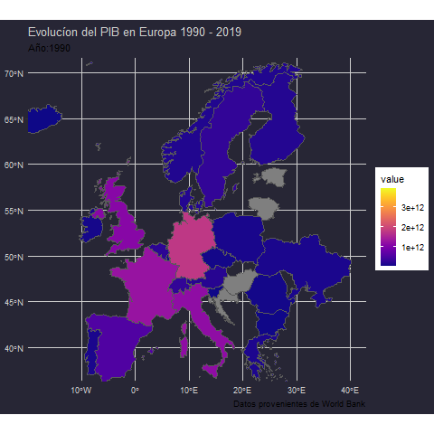

```{r packages-setup, include = FALSE}
library(tidyverse)
library(klippy)  #- remotes::install_github("rlesur/klippy")
library(knitr)
library(lubridate)
library(gghighlight)
library(corrplot)
library(readr)
library(ggplot2)
library(dplyr)
library(plotly)
library(hrbrthemes)
```

```{r chunk-setup, include = FALSE}
knitr::opts_chunk$set(echo = FALSE, eval = TRUE, message = FALSE, warning = FALSE,paged.print=TRUE, 
                      #eval = "hold",
                      cache = FALSE, cache.path = "/caches/", comment = "#>",
                      #fig.width = 7, #fig.height= 7,   
                      #out.width = 7, out.height = 7,
                      collapse = TRUE,  fig.show = "hold",
                      fig.asp = 7/9, out.width = "60%", fig.align = "center")
knitr::opts_chunk$set(dev = "png", dev.args = list(type = "cairo-png"))
```

```{r options-setup, include = FALSE}
options(scipen = 999) #- para quitar la notación científica
options("yaml.eval.expr" = TRUE) 
```


```{r klippy, echo = FALSE}
klippy::klippy(position = c("top", "right")) #- remotes::install_github("rlesur/klippy")
```

<hr class="linea-black">
<div class = "caja-1">
Trabajo elaborado para la asignatura "Programación y manejo de datos en la era del Big Data" de la Universitat de València durante el curso 2020-2021. El repo del trabajo está [aquí](https://github.com/perezp44/trabajo_BigData){target="_blank"}. La página web de la asignatura y los trabajos de mis compañeros pueden verse [aquí](https://perezp44.github.io/intro-ds-20-21-web/07-trabajos.html){target="_blank"}.

<!-- El párrafo de arriba has de dejarlo casi igual, 
        solo HAS de SUSTITUIR las 2 veces que aparece "perezp44" por tu usuario de Github-->
</div>


#  Introducción {.tabset .tabset-pills}
<div class = "caja-1">
A continuación explicaremos los indicadores económicos más relevantes en la macroecónomia, para ello utilizaremos datos extraídos principalmente de la base de datos del banco mundial. Todos los gráficos son de elaboración propia , en su mayoría utilizando la función ggplot() del paquete tidyverse.

en este trabajo contestaremos a las siguientes cuestiones:

1. Evidencia empírica de la paridad cubierta y descubierta de
intereses. ¿En qué grado se cumple esta teoría?
2. Evidencia empírica de la PPA absoluta y relativa. ¿En qué grado
se cumple esta teoría?
3. Desequilibrios globales: Ahorro, Inversión, Balanza por cuenta
corriente. Evolución histórica para el país que consideréis
4. Beneficios de la globalización financiera en el país que
consideréis.
5. Balanza de Pagos y deuda externa (deuda soberana). Evolución
histórica para el país que consideréis.
6. La política de estabilización en una economía abierta: Política
Fiscal y Monetaria. Análisis teórico, en función de si el país es
pequeño o grande en el contexto internacional del efecto de
dichas políticas sobre la renta, los tipos de interés y tipos de
cambio
7. Cualquier tema relacionado con la macroeconomía
internacional y que pueda estar de actualidad. Por ejemplo,
deslocalizaciones de empresas, guerras comerciales etc.

Como podemos ver en el mapa, Alemania es el país de la UE con mayor PIB y su liderazgo se ha incrementado en los últimos años.
</div>

## Mapa



## Código
```{r mapa código, eval=FALSE, results=FALSE, echo=TRUE}

library(ggthemes) # Load
library(tidyverse)
library(rio)
library(plotly)
library(janitor)
library(gganimate)
library(viridis)
library("sf")
library(tidyverse)
world <- rnaturalearth::ne_countries(scale = "medium", returnclass = "sf")
world_points<- st_centroid(world)
world_points <- cbind(world, st_coordinates(st_centroid(world$geometry)))

df_pwr<- read_csv("./datos/pib5.csv") %>% select(-c(`Series Name`,`Series Code`))  %>% rename(sovereignt = `Country Name`,
          `1990`=`1990 [YR1990]`,
          `1991`=`1991 [YR1991]`,
          `1992`=`1992 [YR1992]`,
          `1993`=`1993 [YR1993]`,
          `1994`=`1994 [YR1994]`,
          `1995`=`1995 [YR1995]`,
          `1996`=`1996 [YR1996]`,
          `1997`=`1997 [YR1997]`,
          `1998`=`1998 [YR1998]`,
          `1999`=`1999 [YR1999]`,
          `2000`=`2000 [YR2000]`,
          `2001`=`2001 [YR2001]`,
          `2002`=`2002 [YR2002]`,
          `2003`=`2003 [YR2003]`,
          `2004`=`2004 [YR2004]`,
          `2005`=`2005 [YR2005]`,
          `2006`=`2006 [YR2006]`,
          `2007`=`2007 [YR2007]`,
          `2008`=`2008 [YR2008]`,
          `2009`=`2009 [YR2009]`,
          `2010`=`2010 [YR2010]`,
          `2011`=`2011 [YR2011]`,
          `2012`=`2012 [YR2012]`,
          `2013`=`2013 [YR2013]`,
          `2014`=`2014 [YR2014]` ,
          `2015`=`2015 [YR2015]`,
          `2016`=`2016 [YR2016]`,
          `2017`=`2017 [YR2017]`,
          `2018`=`2018 [YR2018]`,
          `2019`=`2019 [YR2019]`

  )

df_pwr20 <- df_pwr %>%  pivot_longer(cols = 3:32, names_to = "year") %>% transform(year = as.numeric(year),
                                                                                  value = as.numeric(value)
                                                                                  )


df_pwr5 <- inner_join(world, df_pwr20, by= c("sovereignt" = "sovereignt")) %>% filter(continent == "Europe", sovereignt != "Bosnia and Herzegovina")

df_pwr9 <- df_pwr5 %>% select(sovereignt, year, value)
p <- ggplot() + geom_sf(data = df_pwr9, aes(fill = value)) +
  labs(title = "Mapa del mundo energias renovables 1990 - 2015",
       caption = "Datos provenientes de World Bank") +
  scale_fill_viridis(direction = 1) +
  transition_time(year) + labs(title = "Porcentaje de energia renovable por país", subtitle = "Año:{as.integer(frame_time)}"  ) +
  coord_sf(xlim = c(-17, 40), ylim = c(38, 70))+
  theme(
    panel.background = element_rect(fill ='#272635' ,
                                    colour = '#272635',
                                    size = 0.5, linetype = "solid"),
    plot.background = element_rect(fill ='#272635' ,
                                   colour = '#272635',
                                   size = 0.5, linetype = "solid"),
    panel.grid.major = element_line(size = 0.5, linetype = 'solid',
                                    colour = '#CECECE'), 
    panel.grid.minor = element_line(size = 0.25, linetype = 'solid',
                                    colour = '#CECECE'),
    axis.text.x =element_text(colour='#CECECE'),
    axis.text.y =element_text(colour='#CECECE'),
    plot.title = element_text(colour = '#CECECE'),
    axis.title.x = element_text(colour = "#CECECE"),
    axis.title.y = element_text(colour = "#CECECE"),
    # panel.border = element_rect(fill='#272635')
  )

anim1 <- animate(p)

anim_save("./imagenes/map.gif", anim1)


```
# 1. Paridad cubierta y descubierta de los tipos de interés {.tabset .tabset-pills}

## Gráfico
```{r Gráfico tipos de cambio, echo=FALSE}
#Gráfico tipo de cambio EURO

exch_ger_csv2<- read_csv("./datos/eurofxref.csv")
Inflation<- read_csv("./datos/inflation.csv")

ger_exch9 <- exch_ger_csv2 %>% select(Date, USD, CNY, GBP, JPY) %>% drop_na() %>% pivot_longer(cols = 2:5, names_to = "currency", values_to = "exchange_rate")


p <-ggplot(ger_exch9, aes(Date, exchange_rate,group = currency )) +
  geom_line(aes(color = currency)) +

  theme(axis.title.y=element_blank(),
        axis.text.y=element_blank(),
        axis.ticks.y=element_blank())+
  geom_smooth() +
  labs(x = "Año", y = "exchange rate", 
       title = "Tipo de cambio €") +
  facet_grid(rows = vars(currency),scales = "free") +
  theme(legend.title = element_blank())+
  theme(
     panel.background = element_rect(fill ='#272635' ,
                                colour = '#272635',
                                size = 0.5, linetype = "solid"),
  plot.background = element_rect(fill ='#272635' ,
                                colour = '#272635',
                                size = 0.5, linetype = "solid"),
  panel.grid.major = element_line(size = 0.5, linetype = 'solid',
                                colour = '#CECECE'), 
  panel.grid.minor = element_line(size = 0.25, linetype = 'solid',
                                colour = '#CECECE'),
  axis.text.x =element_text(colour='#CECECE'),
  axis.text.y =element_text(colour='#CECECE'),
  plot.title = element_text(colour = '#CECECE'),
  axis.title.x = element_text(colour = "#CECECE"),
        axis.title.y = element_text(colour = "#CECECE"),
       # panel.border = element_rect(fill='#272635')
  )

p

```

## Código
```{r código tipos de cambio, eval=FALSE, echo= TRUE, message=FALSE}
#Gráfico tipo de cambio EURO

exch_ger_csv2<- read_csv("./datos/eurofxref.csv")
Inflation<- read_csv("./datos/inflation.csv")

ger_exch9 <- exch_ger_csv2 %>% select(Date, USD, CNY, GBP, JPY) %>% drop_na() %>% pivot_longer(cols = 2:5, names_to = "currency", values_to = "exchange_rate")


p <-ggplot(ger_exch9, aes(Date, exchange_rate,group = currency )) +
  geom_line(aes(color = currency)) +

  theme(axis.title.y=element_blank(),
        axis.text.y=element_blank(),
        axis.ticks.y=element_blank())+
  geom_smooth() +
  labs(x = "Año", y = "exchange rate", 
       title = "Tipo de cambio €") +
  facet_grid(rows = vars(currency),scales = "free") +
  theme(legend.title = element_blank())+
  theme(
     panel.background = element_rect(fill ='#272635' ,
                                colour = '#272635',
                                size = 0.5, linetype = "solid"),
  plot.background = element_rect(fill ='#272635' ,
                                colour = '#272635',
                                size = 0.5, linetype = "solid"),
  panel.grid.major = element_line(size = 0.5, linetype = 'solid',
                                colour = '#CECECE'), 
  panel.grid.minor = element_line(size = 0.25, linetype = 'solid',
                                colour = '#CECECE'),
  axis.text.x =element_text(colour='#CECECE'),
  axis.text.y =element_text(colour='#CECECE'),
  plot.title = element_text(colour = '#CECECE'),
  axis.title.x = element_text(colour = "#CECECE"),
        axis.title.y = element_text(colour = "#CECECE"),
       # panel.border = element_rect(fill='#272635')
  )

p

```

# {-}

<div class = "caja-1">

En el siguiente Gráfico podemos ver como ha variado el tipo de cambio del euro con respecto a otras monedas del mundo a lo largo de los últimos 20 años. Como podemos observar hay cierta correlación entre los cambios con las diferentes monedas, además los tipos de cambio fluctúan mucho en un corto periodo de tiempo.
</div>


### Paridad Cubierta 

<div class = "caja-1">
Hablamos de Paridad cubierta de los tipos de interés cuando al realizar una inversión en un depósito en yenes  , el riesgo que proviene de el tipo de cambio a futuro entre el yen  y el € queda asegurado por un contrato realizado a futuro. Así nos aseguramos de que en el caso de realizar una inversión en una moneda extranjera los tipos de interés obtenidos no se pierdan por las fluctuaciones en el tipo de cambio.


$$ (1 + i_{\alpha}) = (1 + i_{\epsilon})\frac{F_{\frac{\alpha}{\epsilon}}}{E_{\frac{\alpha}{\epsilon}}} $$

</div>


### Paridad Descubierta

<div class = "caja-1">
La paridad descubierta de intereses es una condición de ausencia de arbitraje que describe un equilibrio en el que los inversores son indiferentes entre depósitos bancarios remunerados en dos monedas sin que se haya cubierto el riesgo cambiario. Al contrario que en la paridad cubierta, en este caso el riesgo originado por las fluctuaciones cambiarias entre las dos monedas no queda cubierto y aún así el inversor está indiferente entre un deposito en ¥ o en €.
</div>


<div class = "caja-1">

\begin{align}
E_{\frac{\alpha}{\epsilon}} = E_{\frac{\alpha}{\epsilon}}^{e} \frac{1+i_{\epsilon}}{1+i_{\alpha}}


\rightarrow


i_{\alpha} = i_{\epsilon} + \frac{\bigtriangleup E_{\frac{\alpha}{\epsilon}}^{e}}{E_{\frac{\alpha}{\epsilon}}}
\end{align}

</div>


# 2. PPA absoluta y relativa 

<div class = "caja-1">
Para entender la PPA absoluta hay que hablar primero de la Ley del Precio Único o LPU, es la condición por la cual el precio de un bien en un país es igual al precio de este bien en otro país, todo esto descontando costes de transporte, almacenamiento, etc. Esto nos asegura que no se produzca arbitraje ya que el mercado estará en equilibrio.

## PPA absoluta
La PPA absoluta se produce cuando el valor de la misma cesta es el mismo en diferentes países, o lo que es lo mismo, cuando el tipo de cambio real es igual a 1.

\begin{align}

E_{\frac{\alpha}{\epsilon}} =     \frac{P_{\alpha}}{P_{\epsilon}}

\end{align}


</div>

## PPA Relativa {.tabset .tabset-pills}

### Gráfico
```{r gráfico ppa relativa, echo=FALSE, warning=FALSE}

RPCS<- read_csv("./datos/Relativepcs.csv") %>% drop_na() %>% rename("2000" = `2000 [YR2000]`,
                                                                    "2001" = `2001 [YR2001]`,
                                                                    "2002" = `2002 [YR2002]`,
                                                                    "2003" = `2003 [YR2003]`,
                                                                    "2004" = `2004 [YR2004]`,
                                                                    "2005" = `2005 [YR2005]`,
                                                                    "2006" = `2006 [YR2006]`,
                                                                    "2007" = `2007 [YR2007]`,
                                                                    "2008" = `2008 [YR2008]`,
                                                                    "2009" = `2009 [YR2009]`,
                                                                    "2010" = `2010 [YR2010]`,
                                                                    "2011" = `2011 [YR2011]`,
                                                                    "2012" = `2012 [YR2012]`,
                                                                    "2013" = `2013 [YR2013]`,
                                                                    "2014" = `2014 [YR2014]`,
                                                                    "2015" = `2015 [YR2015]`,
                                                                    "2016" = `2016 [YR2016]`,
                                                                    "2017" = `2017 [YR2017]`,
                                                                    "2018" = `2018 [YR2018]`,
                                                                    "2019" = `2019 [YR2019]`)  %>% 
  pivot_longer(cols = 5:24, names_to = "year", values_to = "rpcs") %>% 
  select('Country Name', year, rpcs) %>%  mutate(year = as.numeric(year)) %>% pivot_wider(names_from = 'Country Name', values_from = "rpcs") %>% 
  mutate(rpcs = (Germany/`United States`)) %>% select(rpcs,year)


ger_exch12 <- ger_exch9 %>% filter(currency == "USD") %>% 
  mutate(year = year(Date)) %>% 
  mutate(month = month(Date)) %>% 
  mutate(day = day(Date)) %>% filter(day ==  2) %>% filter(month == 1) %>% select(year,exchange_rate)


d <- inner_join(ger_exch12,RPCS) 


ggplot(d)+ 

geom_line(aes(x= year,y = rpcs, colour = "Precios relativos")) +
  geom_line(aes(x= year,y = exchange_rate, colour = "Tipo de cambio")) +
  scale_colour_manual("", 
                      breaks = c("Precios relativos", "Tipo de cambio"),
                      values = c("lightblue", "green")) +
  geom_smooth(aes(year,rpcs),color = "lightblue",method = "lm") +
  geom_smooth(aes(year,exchange_rate),color = "green",method = "lm") +
  xlab(" ") +
  scale_y_continuous(" ", limits = c(0.9,2)) + 
  labs(title = "PPA RELATIVA",
       subtitle = "Alemania 2006-2020",
       x= "Año",
       y = " ") +
  theme(
     panel.background = element_rect(fill ='#272635' ,
                                colour = '#272635',
                                size = 0.5, linetype = "solid"),
  plot.background = element_rect(fill ='#272635' ,
                                colour = '#272635',
                                size = 0.5, linetype = "solid"),
  panel.grid.major = element_line(size = 0.5, linetype = 'solid',
                                colour = '#CECECE'), 
  panel.grid.minor = element_line(size = 0.25, linetype = 'solid',
                                colour = '#CECECE'),
  axis.text.x =element_text(colour='#CECECE'),
  axis.text.y =element_text(colour='#CECECE'),
  plot.title = element_text(colour = '#CECECE'),
  axis.title.x = element_text(colour = "#CECECE"),
        axis.title.y = element_text(colour = "#CECECE"),
       # panel.border = element_rect(fill='#272635')
  )


```

### código
```{r CÓDIGO ppa relativa, echo= TRUE, warning=FALSE, eval = FALSE, message = FALSE}

RPCS<- read_csv("./datos/Relativepcs.csv") %>% drop_na() %>% rename("2000" = `2000 [YR2000]`,
                                                                    "2001" = `2001 [YR2001]`,
                                                                    "2002" = `2002 [YR2002]`,
                                                                    "2003" = `2003 [YR2003]`,
                                                                    "2004" = `2004 [YR2004]`,
                                                                    "2005" = `2005 [YR2005]`,
                                                                    "2006" = `2006 [YR2006]`,
                                                                    "2007" = `2007 [YR2007]`,
                                                                    "2008" = `2008 [YR2008]`,
                                                                    "2009" = `2009 [YR2009]`,
                                                                    "2010" = `2010 [YR2010]`,
                                                                    "2011" = `2011 [YR2011]`,
                                                                    "2012" = `2012 [YR2012]`,
                                                                    "2013" = `2013 [YR2013]`,
                                                                    "2014" = `2014 [YR2014]`,
                                                                    "2015" = `2015 [YR2015]`,
                                                                    "2016" = `2016 [YR2016]`,
                                                                    "2017" = `2017 [YR2017]`,
                                                                    "2018" = `2018 [YR2018]`,
                                                                    "2019" = `2019 [YR2019]`)  %>% 
  pivot_longer(cols = 5:24, names_to = "year", values_to = "rpcs") %>% 
  select('Country Name', year, rpcs) %>%  mutate(year = as.numeric(year)) %>% pivot_wider(names_from = 'Country Name', values_from = "rpcs") %>% 
  mutate(rpcs = (Germany/`United States`)) %>% select(rpcs,year)


ger_exch12 <- ger_exch9 %>% filter(currency == "USD") %>% 
  mutate(year = year(Date)) %>% 
  mutate(month = month(Date)) %>% 
  mutate(day = day(Date)) %>% filter(day ==  2) %>% filter(month == 1) %>% select(year,exchange_rate)


d <- inner_join(ger_exch12,RPCS) 


ggplot(d)+ 

geom_line(aes(x= year,y = rpcs, colour = "Precios relativos")) +
  geom_line(aes(x= year,y = exchange_rate, colour = "Tipo de cambio")) +
  scale_colour_manual("", 
                      breaks = c("Precios relativos", "Tipo de cambio"),
                      values = c("red", "blue")) +
  geom_smooth(aes(year,rpcs),color = "red",method = "lm") +
  geom_smooth(aes(year,exchange_rate),color = "blue",method = "lm") +
  xlab(" ") +
  scale_y_continuous(" ", limits = c(0.9,2)) + 
  labs(title = "PPA RELATIVA",
       subtitle = "Alemania 2006-2020",
       x= "Año",
       y = " ") +
  theme(
     panel.background = element_rect(fill ='#272635' ,
                                colour = '#272635',
                                size = 0.5, linetype = "solid"),
  plot.background = element_rect(fill ='#272635' ,
                                colour = '#272635',
                                size = 0.5, linetype = "solid"),
  panel.grid.major = element_line(size = 0.5, linetype = 'solid',
                                colour = '#CECECE'), 
  panel.grid.minor = element_line(size = 0.25, linetype = 'solid',
                                colour = '#CECECE'),
  axis.text.x =element_text(colour='#CECECE'),
  axis.text.y =element_text(colour='#CECECE'),
  plot.title = element_text(colour = '#CECECE'),
  axis.title.x = element_text(colour = "#CECECE"),
        axis.title.y = element_text(colour = "#CECECE"),
       # panel.border = element_rect(fill='#272635')
  )


```
## {-}

<div class = "caja-1">

La PPA relativa aparece cuando expresamos la anterior expresión en términos de crecimiento, Obteniendo la siguiente expresión:


\begin{align}

    \underbrace{\frac{\bigtriangleup E_{\frac{\alpha}{\epsilon},t}}{E_{\frac{\alpha}{\epsilon},t}}}_\text{Tasa de depreciación del tipo de cambio nominal} = \underbrace{\pi_{\alpha,t} - \pi_{\epsilon,t} }_\text{Diferencial de Inflación}
    
      

\end{align}


Si observamos la relación entre el precio relativo y los tipos de cambio Euro -dólar, podemos observar como a corto plazo (Verde) no se cumple la PPA relativa, pero a Largo plazo (azul) ambos tienden a disminuir, es decir, la evidencia empírica nos indica que la PPA relativa solo se cumple a largo plazo.
</div>

# 3. Desequilibrios globales
## PIB {.tabset .tabset-pills}
### Gráfico
```{r Gráfico PIB}
pib <- read_csv("./datos/PIB.csv") %>%  drop_na() %>% rename("2000" = `2000 [YR2000]`,
                                                                    "2001" = `2001 [YR2001]`,
                                                                    "2002" = `2002 [YR2002]`,
                                                                    "2003" = `2003 [YR2003]`,
                                                                    "2004" = `2004 [YR2004]`,
                                                                    "2005" = `2005 [YR2005]`,
                                                                    "2006" = `2006 [YR2006]`,
                                                                    "2007" = `2007 [YR2007]`,
                                                                    "2008" = `2008 [YR2008]`,
                                                                    "2009" = `2009 [YR2009]`,
                                                                    "2010" = `2010 [YR2010]`,
                                                                    "2011" = `2011 [YR2011]`,
                                                                    "2012" = `2012 [YR2012]`,
                                                                    "2013" = `2013 [YR2013]`,
                                                                    "2014" = `2014 [YR2014]`,
                                                                    "2015" = `2015 [YR2015]`,
                                                                    "2016" = `2016 [YR2016]`,
                                                                    "2017" = `2017 [YR2017]`,
                                                                    "2018" = `2018 [YR2018]`,
                                                                    "2019" = `2019 [YR2019]`)  %>% pivot_longer(cols = 5:24, names_to = "year", values_to = "PIB") %>% 
  select(year,PIB) %>% mutate(PIB = PIB/1000000000)


ggplot(pib,aes(year,PIB,group = 1)) +
  geom_smooth(color = "green", se= FALSE) +
  geom_line(color= "navyblue", size = 2) +
  theme(axis.text.x = element_text(angle = 60, hjust = 1)) +
  labs(title = "PIB",
       subtitle = "Alemania 2000-2019",
       caption = "World Bank, en $ actuales",
       y = "mil. mill. $",
       x = "Año") +
  theme(
     panel.background = element_rect(fill ='#272635' ,
                                colour = '#272635',
                                size = 0.5, linetype = "solid"),
  plot.background = element_rect(fill ='#272635' ,
                                colour = '#272635',
                                size = 0.5, linetype = "solid"),
  panel.grid.major = element_line(size = 0.5, linetype = 'solid',
                                colour = '#CECECE'), 
  panel.grid.minor = element_line(size = 0.25, linetype = 'solid',
                                colour = '#CECECE'),
  axis.text.x =element_text(colour='#CECECE'),
  axis.text.y =element_text(colour='#CECECE'),
  plot.title = element_text(colour = '#CECECE'),
  axis.title.x = element_text(colour = "#CECECE"),
        axis.title.y = element_text(colour = "#CECECE"),
       # panel.border = element_rect(fill='#272635')
  )
  


```

### Código
```{r Código PIB, echo= TRUE, eval=FALSE}
pib <- read_csv("./datos/PIB.csv") %>%  drop_na() %>% rename("2000" = `2000 [YR2000]`,
                                                                    "2001" = `2001 [YR2001]`,
                                                                    "2002" = `2002 [YR2002]`,
                                                                    "2003" = `2003 [YR2003]`,
                                                                    "2004" = `2004 [YR2004]`,
                                                                    "2005" = `2005 [YR2005]`,
                                                                    "2006" = `2006 [YR2006]`,
                                                                    "2007" = `2007 [YR2007]`,
                                                                    "2008" = `2008 [YR2008]`,
                                                                    "2009" = `2009 [YR2009]`,
                                                                    "2010" = `2010 [YR2010]`,
                                                                    "2011" = `2011 [YR2011]`,
                                                                    "2012" = `2012 [YR2012]`,
                                                                    "2013" = `2013 [YR2013]`,
                                                                    "2014" = `2014 [YR2014]`,
                                                                    "2015" = `2015 [YR2015]`,
                                                                    "2016" = `2016 [YR2016]`,
                                                                    "2017" = `2017 [YR2017]`,
                                                                    "2018" = `2018 [YR2018]`,
                                                                    "2019" = `2019 [YR2019]`)  %>% pivot_longer(cols = 5:24, names_to = "year", values_to = "PIB") %>% 
  select(year,PIB) %>% mutate(PIB = PIB/1000000000)


ggplot(pib,aes(year,PIB,group = 1)) +
  geom_smooth(color = "green", se= FALSE) +
  geom_line(color= "navyblue", size = 2) +
  theme(axis.text.x = element_text(angle = 60, hjust = 1)) +
  labs(title = "PIB",
       subtitle = "Alemania 2000-2019",
       caption = "World Bank, en $ actuales",
       y = "mil. mill. $",
       x = "Año")
```

## {-}
<div class = "caja-1">
Como podemos observar, la economía alemana ha crecido notablemente en los últimos 20 años, el período 2000-2007 está caracterizado por un rápido y continuo aumento del PIB, periodo en el que la unión europea empieza una etapa con mucha más integración y en la que Alemania sale muy beneficiada, sobre todo en lo que se refiere al comercio en la UE. La introducción del Euro como moneda única y la eliminación de las barreras arancelarias en los últimos años hace que Alemania aproveche esta oportunidad y se fortalezca como potencia en fabricación de maquinaria y tecnología punta en Europa. A partir de 2007 con la llegada de la crisis y los problemas internos de las economías europeas, el crecimiento alemán del PIB se frena considerablemente. El rescate de Grecia y el “casi” rescate del resto de las economías más afectadas por la crisis como España y Portugal entre otras, hace que la economía alemana tenga que pisar el freno.
</div>

## Ahorro {.tabset .tabset-pills}

### Gráfico

```{r Gráfico Ahorro}
savger <- read_csv("./datos/savingsger.csv")
ger_sav <- savger %>% drop_na() %>% rename("2000" = `2000 [YR2000]`,
                                              "2001" = `2001 [YR2001]`,
                                              "2002" = `2002 [YR2002]`,
                                              "2003" = `2003 [YR2003]`,
                                              "2004" = `2004 [YR2004]`,
                                              "2005" = `2005 [YR2005]`,
                                              "2006" = `2006 [YR2006]`,
                                              "2007" = `2007 [YR2007]`,
                                              "2008" = `2008 [YR2008]`,
                                              "2009" = `2009 [YR2009]`,
                                              "2010" = `2010 [YR2010]`,
                                              "2011" = `2011 [YR2011]`,
                                              "2012" = `2012 [YR2012]`,
                                              "2013" = `2013 [YR2013]`,
                                              "2014" = `2014 [YR2014]`,
                                              "2015" = `2015 [YR2015]`,
                                              "2016" = `2016 [YR2016]`,
                                              "2017" = `2017 [YR2017]`,
                                              "2018" = `2018 [YR2018]`,
                                              "2019" = `2019 [YR2019]`)  %>% pivot_longer(cols = 5:24, names_to = "year", values_to = "savings")
ger_sav2<- ger_sav %>% select('Country Name', year, savings) %>%  mutate(year = as.numeric(year))


ggplot() +
  geom_line(aes(year,savings,group= 1),colour="blue",ger_sav2) +
  geom_smooth(aes(year,savings),colour = "green",ger_sav2) +
  labs(title="Ahorro",
       subtitle = "Alemania 2000-2019",
       x = "Año",
       y ="%PIB")+
  theme(
     panel.background = element_rect(fill ='#272635' ,
                                colour = '#272635',
                                size = 0.5, linetype = "solid"),
  plot.background = element_rect(fill ='#272635' ,
                                colour = '#272635',
                                size = 0.5, linetype = "solid"),
  panel.grid.major = element_line(size = 0.5, linetype = 'solid',
                                colour = '#CECECE'), 
  panel.grid.minor = element_line(size = 0.25, linetype = 'solid',
                                colour = '#CECECE'),
  axis.text.x =element_text(colour='#CECECE'),
  axis.text.y =element_text(colour='#CECECE'),
  plot.title = element_text(colour = '#CECECE'),
  axis.title.x = element_text(colour = "#CECECE"),
        axis.title.y = element_text(colour = "#CECECE"),
       # panel.border = element_rect(fill='#272635')
  )
```

### Código

```{r Código Ahorro, eval= FALSE, echo= TRUE}
savger <- read_csv("./datos/savingsger.csv")
ger_sav <- savger %>% drop_na() %>% rename("2000" = `2000 [YR2000]`,
                                              "2001" = `2001 [YR2001]`,
                                              "2002" = `2002 [YR2002]`,
                                              "2003" = `2003 [YR2003]`,
                                              "2004" = `2004 [YR2004]`,
                                              "2005" = `2005 [YR2005]`,
                                              "2006" = `2006 [YR2006]`,
                                              "2007" = `2007 [YR2007]`,
                                              "2008" = `2008 [YR2008]`,
                                              "2009" = `2009 [YR2009]`,
                                              "2010" = `2010 [YR2010]`,
                                              "2011" = `2011 [YR2011]`,
                                              "2012" = `2012 [YR2012]`,
                                              "2013" = `2013 [YR2013]`,
                                              "2014" = `2014 [YR2014]`,
                                              "2015" = `2015 [YR2015]`,
                                              "2016" = `2016 [YR2016]`,
                                              "2017" = `2017 [YR2017]`,
                                              "2018" = `2018 [YR2018]`,
                                              "2019" = `2019 [YR2019]`)  %>% pivot_longer(cols = 5:24, names_to = "year", values_to = "savings")
ger_sav2<- ger_sav %>% select('Country Name', year, savings) %>%  mutate(year = as.numeric(year))


ggplot() +
  geom_line(aes(year,savings,group= 1),colour="blue",ger_sav2) +
  geom_smooth(aes(year,savings),colour = "green",ger_sav2) +
  labs(title="Ahorro",
       subtitle = "Alemania 2000-2019",
       x = "Año",
       y ="%PIB")+
  theme(
     panel.background = element_rect(fill ='#272635' ,
                                colour = '#272635',
                                size = 0.5, linetype = "solid"),
  plot.background = element_rect(fill ='#272635' ,
                                colour = '#272635',
                                size = 0.5, linetype = "solid"),
  panel.grid.major = element_line(size = 0.5, linetype = 'solid',
                                colour = '#CECECE'), 
  panel.grid.minor = element_line(size = 0.25, linetype = 'solid',
                                colour = '#CECECE'),
  axis.text.x =element_text(colour='#CECECE'),
  axis.text.y =element_text(colour='#CECECE'),
  plot.title = element_text(colour = '#CECECE'),
  axis.title.x = element_text(colour = "#CECECE"),
        axis.title.y = element_text(colour = "#CECECE"),
       # panel.border = element_rect(fill='#272635')
  )
```


## {-}
<div class = "caja-1">
Podemos Observar que el ahorro ha aumentado de manera considerable en los últimos 20 años.  Si nos centramos enn el periodo entre 2007 y 2011 (Crisis) el ahorro se vuelve muy volátil, establizandose en los últimos años con una tendencia ascendente.
<div/>

## Inversión {.tabset .tabset-pills}
### Gráfico
```{r Gráfico Inversión}
invest <- read_csv("./datos/investment.csv") 
invest2 <- invest %>% filter(`Indicator Id` == 345, `Country Name` == "Germany") %>%  pivot_longer(cols = 6:50, names_to = "year", values_to = "investment") %>% 
  select("year","investment") %>%  filter(year <= 2020,year >1999) 
invest3 <- transform(invest2,year = as.numeric(year))      
ger_sav3 <-  transform(ger_sav2,year = as.numeric(year)) 

ggplot(invest3) +
  geom_bar(aes(year,investment,fill= investment),stat="identity") +
  labs(title = "Inversión %PIB",
       subtitle = "Alemania 2000-2019",
       x= "Año",
       y = "%PIB") +
  geom_smooth(aes(year,investment, group= 1), color= "Turquoise")+
  theme(
     panel.background = element_rect(fill ='#272635' ,
                                colour = '#272635',
                                size = 0.5, linetype = "solid"),
  plot.background = element_rect(fill ='#272635' ,
                                colour = '#272635',
                                size = 0.5, linetype = "solid"),
  panel.grid.major = element_line(size = 0.5, linetype = 'solid',
                                colour = '#CECECE'), 
  panel.grid.minor = element_line(size = 0.25, linetype = 'solid',
                                colour = '#CECECE'),
  axis.text.x =element_text(colour='#CECECE'),
  axis.text.y =element_text(colour='#CECECE'),
  plot.title = element_text(colour = '#CECECE'),
  axis.title.x = element_text(colour = "#CECECE"),
        axis.title.y = element_text(colour = "#CECECE"),
       # panel.border = element_rect(fill='#272635')
  )+
  theme(
     panel.background = element_rect(fill ='#272635' ,
                                colour = '#272635',
                                size = 0.5, linetype = "solid"),
  plot.background = element_rect(fill ='#272635' ,
                                colour = '#272635',
                                size = 0.5, linetype = "solid"),
  panel.grid.major = element_line(size = 0.5, linetype = 'solid',
                                colour = '#CECECE'), 
  panel.grid.minor = element_line(size = 0.25, linetype = 'solid',
                                colour = '#CECECE'),
  axis.text.x =element_text(colour='#CECECE'),
  axis.text.y =element_text(colour='#CECECE'),
  plot.title = element_text(colour = '#CECECE'),
  axis.title.x = element_text(colour = "#CECECE"),
        axis.title.y = element_text(colour = "#CECECE"),
       # panel.border = element_rect(fill='#272635')
  )


```

### Código
```{r Código Inversión, eval= FALSE, echo= TRUE}
invest <- read_csv("./datos/investment.csv") 
invest2 <- invest %>% filter(`Indicator Id` == 345, `Country Name` == "Germany") %>%  pivot_longer(cols = 6:50, names_to = "year", values_to = "investment") %>% 
  select("year","investment") %>%  filter(year <= 2020,year >1999) 
invest3 <- transform(invest2,year = as.numeric(year))      
ger_sav3 <-  transform(ger_sav2,year = as.numeric(year)) 

ggplot(invest3) +
  geom_bar(aes(year,investment,fill= investment),stat="identity") +
  labs(title = "Inversión %PIB",
       subtitle = "Alemania 2000-2019",
       x= "Año",
       y = "%PIB") +
  geom_smooth(aes(year,investment, group= 1), color= "Turquoise")+
  theme(
     panel.background = element_rect(fill ='#272635' ,
                                colour = '#272635',
                                size = 0.5, linetype = "solid"),
  plot.background = element_rect(fill ='#272635' ,
                                colour = '#272635',
                                size = 0.5, linetype = "solid"),
  panel.grid.major = element_line(size = 0.5, linetype = 'solid',
                                colour = '#CECECE'), 
  panel.grid.minor = element_line(size = 0.25, linetype = 'solid',
                                colour = '#CECECE'),
  axis.text.x =element_text(colour='#CECECE'),
  axis.text.y =element_text(colour='#CECECE'),
  plot.title = element_text(colour = '#CECECE'),
  axis.title.x = element_text(colour = "#CECECE"),
        axis.title.y = element_text(colour = "#CECECE"),
       # panel.border = element_rect(fill='#272635')
  )


```

## {-}
<div class = "caja-1">
En cuanto a la inversión podemos destacar su estabilidad respecto al PIB en los últimos 20 años, moviéndose en valores que oscilan entre el 19% y el 23% del PIB en los últimos 20 años. En el 2000 podemos observar el valor mas alto de los últimos años, el mínimo está en 2007 cuando con la llegada de la crisis, la mayoría de las economías europeas entraron en recesión y se frenó bruscamente la inversión, Alemania no se vio tan afectada en este sentido como por ejemplo Grecia cuya inversión paso de un 26% del PIB a un 13% aproximadamente.
</div>
## Ahorro e Inversión {.tabset .tabset-pills}
### Gráfico

```{r Gráfico Ahorro e Inversión}
gersavinv <- inner_join(invest3,ger_sav3) %>% select(investment,savings, year)%>% rename("Ahorro" = savings,"Inversión" = investment) %>% pivot_longer(cols = 1:2,names_to = "tipo", values_to = "n" ) 

ggplot(gersavinv,aes(year,n, group = tipo,color = tipo)) +
  geom_line(size = 2) +
  geom_smooth(se = FALSE, method = "lm",color = "black") +
  labs(y = "%PIB",
       x = "Año",
       subtitle =  "Alemania 2000-2019")+
  theme(
     panel.background = element_rect(fill ='#272635' ,
                                colour = '#272635',
                                size = 0.5, linetype = "solid"),
  plot.background = element_rect(fill ='#272635' ,
                                colour = '#272635',
                                size = 0.5, linetype = "solid"),
  panel.grid.major = element_line(size = 0.5, linetype = 'solid',
                                colour = '#CECECE'), 
  panel.grid.minor = element_line(size = 0.25, linetype = 'solid',
                                colour = '#CECECE'),
  axis.text.x =element_text(colour='#CECECE'),
  axis.text.y =element_text(colour='#CECECE'),
  plot.title = element_text(colour = '#CECECE'),
  axis.title.x = element_text(colour = "#CECECE"),
        axis.title.y = element_text(colour = "#CECECE"),
       # panel.border = element_rect(fill='#272635')
  )
```

### Correlación

```{r Correlación entre Ahorro e Inversión}


gersavinv<-inner_join(invest3,ger_sav3) %>% select(investment,savings, year)
m <-gersavinv%>% filter(year>2006) %>% select(investment,savings) 
n<-cor(m,method= "pearson")
corrplot(n,
                      method = "number"
)

```

### Código
```{r Código a e I corr,echo= TRUE, eval= FALSE}
gersavinv <- inner_join(invest3,ger_sav3) %>% select(investment,savings, year)%>% rename("Ahorro" = savings,"Inversión" = investment) %>% pivot_longer(cols = 1:2,names_to = "tipo", values_to = "n" ) 

ggplot(gersavinv,aes(year,n, group = tipo,color = tipo)) +
  geom_line(size = 2) +
  geom_smooth(se = FALSE, method = "lm",color = "black") +
  labs(y = "%PIB",
       x = "Año",
       subtitle =  "Alemania 2000-2019")+
  theme(
     panel.background = element_rect(fill ='#272635' ,
                                colour = '#272635',
                                size = 0.5, linetype = "solid"),
  plot.background = element_rect(fill ='#272635' ,
                                colour = '#272635',
                                size = 0.5, linetype = "solid"),
  panel.grid.major = element_line(size = 0.5, linetype = 'solid',
                                colour = '#CECECE'), 
  panel.grid.minor = element_line(size = 0.25, linetype = 'solid',
                                colour = '#CECECE'),
  axis.text.x =element_text(colour='#CECECE'),
  axis.text.y =element_text(colour='#CECECE'),
  plot.title = element_text(colour = '#CECECE'),
  axis.title.x = element_text(colour = "#CECECE"),
        axis.title.y = element_text(colour = "#CECECE"),
       # panel.border = element_rect(fill='#272635')
  )

gersavinv<-inner_join(invest3,ger_sav3) %>% select(investment,savings, year)
m <-gersavinv%>% filter(year>2006) %>% select(investment,savings) 
n<-cor(m,method= "pearson")
corrplot(n,
                      method = "number"
)
```

## {-}
<div class = "caja-1">

Si observamos ambas variables en un mismo gráfico podemos observar cómo estas tienen un alto grado de correlación*, sobre todo a partir del 2007. 

*Utilizando el método de Pearson y restringiendo las observaciones entre 2006 y 2019.
</div>

## Balanza Comercial {.tabset .tabset-pills}

### Gráfico
```{r Gráfico Exportaciones e Importaciones}


exportaciones <- read_csv("./datos/Exp_ger.csv") %>%  drop_na() %>% rename("2000" = `2000 [YR2000]`,
                                                             "2001" = `2001 [YR2001]`,
                                                             "2002" = `2002 [YR2002]`,
                                                             "2003" = `2003 [YR2003]`,
                                                             "2004" = `2004 [YR2004]`,
                                                             "2005" = `2005 [YR2005]`,
                                                             "2006" = `2006 [YR2006]`,
                                                             "2007" = `2007 [YR2007]`,
                                                             "2008" = `2008 [YR2008]`,
                                                             "2009" = `2009 [YR2009]`,
                                                             "2010" = `2010 [YR2010]`,
                                                             "2011" = `2011 [YR2011]`,
                                                             "2012" = `2012 [YR2012]`,
                                                             "2013" = `2013 [YR2013]`,
                                                             "2014" = `2014 [YR2014]`,
                                                             "2015" = `2015 [YR2015]`,
                                                             "2016" = `2016 [YR2016]`,
                                                             "2017" = `2017 [YR2017]`,
                                                             "2018" = `2018 [YR2018]`,
                                                             "2019" = `2019 [YR2019]`)  %>% pivot_longer(cols = 5:24, names_to = "año", values_to = "exportaciones") %>% 
  select(año,exportaciones)

importaciones <- read_csv("./datos/Imp_ger.csv") %>%  drop_na() %>% rename("2000" = `2000 [YR2000]`,
                                                                 "2001" = `2001 [YR2001]`,
                                                                 "2002" = `2002 [YR2002]`,
                                                                 "2003" = `2003 [YR2003]`,
                                                                 "2004" = `2004 [YR2004]`,
                                                                 "2005" = `2005 [YR2005]`,
                                                                 "2006" = `2006 [YR2006]`,
                                                                 "2007" = `2007 [YR2007]`,
                                                                 "2008" = `2008 [YR2008]`,
                                                                 "2009" = `2009 [YR2009]`,
                                                                 "2010" = `2010 [YR2010]`,
                                                                 "2011" = `2011 [YR2011]`,
                                                                 "2012" = `2012 [YR2012]`,
                                                                 "2013" = `2013 [YR2013]`,
                                                                 "2014" = `2014 [YR2014]`,
                                                                 "2015" = `2015 [YR2015]`,
                                                                 "2016" = `2016 [YR2016]`,
                                                                 "2017" = `2017 [YR2017]`,
                                                                 "2018" = `2018 [YR2018]`,
                                                                 "2019" = `2019 [YR2019]`)  %>% pivot_longer(cols = 5:24, names_to = "año", values_to = "importaciones") %>% 
  select(año,importaciones)


impexp<- inner_join(importaciones, exportaciones) %>% mutate(importaciones = importaciones * -1) %>%   mutate(dif = (exportaciones-(-1*importaciones))) %>% pivot_longer(cols= 2:4,names_to = "tipo",values_to = "n") 

ggplot(impexp) +
  geom_line(aes(año, n,color= tipo,group = tipo),size=2) +
  geom_hline(aes(yintercept=0), color ='#CECECE',size = 2) +
  
  
  theme(axis.text.x = element_text(angle = 60, hjust = 1)) +
  labs(title = "EXPORTACIONES, IMPORTACIONES",
       subtitle = "Alemania 2000-2019",
       caption = "World Bank, en $ actuales",
       x = "Año",
       y= " ")+
  theme(
     panel.background = element_rect(fill ='#272635' ,
                                colour = '#272635',
                                size = 0.5, linetype = "solid"),
  plot.background = element_rect(fill ='#272635' ,
                                colour = '#272635',
                                size = 0.5, linetype = "solid"),
  panel.grid.major = element_line(size = 0.5, linetype = 'solid',
                                colour = '#CECECE'), 
  panel.grid.minor = element_line(size = 0.25, linetype = 'solid',
                                colour = '#CECECE'),
  axis.text.x =element_text(colour='#CECECE'),
  axis.text.y =element_text(colour='#CECECE'),
  plot.title = element_text(colour = '#CECECE'),
  axis.title.x = element_text(colour = "#CECECE"),
        axis.title.y = element_text(colour = "#CECECE"),
       # panel.border = element_rect(fill='#272635')
  )
```


### Código

```{r Código Exportaciones e Importaciones, echo=TRUE, eval = FALSE}


exportaciones <- read_csv("./datos/Exp_ger.csv") %>%  drop_na() %>% rename("2000" = `2000 [YR2000]`,
                                                             "2001" = `2001 [YR2001]`,
                                                             "2002" = `2002 [YR2002]`,
                                                             "2003" = `2003 [YR2003]`,
                                                             "2004" = `2004 [YR2004]`,
                                                             "2005" = `2005 [YR2005]`,
                                                             "2006" = `2006 [YR2006]`,
                                                             "2007" = `2007 [YR2007]`,
                                                             "2008" = `2008 [YR2008]`,
                                                             "2009" = `2009 [YR2009]`,
                                                             "2010" = `2010 [YR2010]`,
                                                             "2011" = `2011 [YR2011]`,
                                                             "2012" = `2012 [YR2012]`,
                                                             "2013" = `2013 [YR2013]`,
                                                             "2014" = `2014 [YR2014]`,
                                                             "2015" = `2015 [YR2015]`,
                                                             "2016" = `2016 [YR2016]`,
                                                             "2017" = `2017 [YR2017]`,
                                                             "2018" = `2018 [YR2018]`,
                                                             "2019" = `2019 [YR2019]`)  %>% pivot_longer(cols = 5:24, names_to = "año", values_to = "exportaciones") %>% 
  select(año,exportaciones)

importaciones <- read_csv("./datos/Imp_ger.csv") %>%  drop_na() %>% rename("2000" = `2000 [YR2000]`,
                                                                 "2001" = `2001 [YR2001]`,
                                                                 "2002" = `2002 [YR2002]`,
                                                                 "2003" = `2003 [YR2003]`,
                                                                 "2004" = `2004 [YR2004]`,
                                                                 "2005" = `2005 [YR2005]`,
                                                                 "2006" = `2006 [YR2006]`,
                                                                 "2007" = `2007 [YR2007]`,
                                                                 "2008" = `2008 [YR2008]`,
                                                                 "2009" = `2009 [YR2009]`,
                                                                 "2010" = `2010 [YR2010]`,
                                                                 "2011" = `2011 [YR2011]`,
                                                                 "2012" = `2012 [YR2012]`,
                                                                 "2013" = `2013 [YR2013]`,
                                                                 "2014" = `2014 [YR2014]`,
                                                                 "2015" = `2015 [YR2015]`,
                                                                 "2016" = `2016 [YR2016]`,
                                                                 "2017" = `2017 [YR2017]`,
                                                                 "2018" = `2018 [YR2018]`,
                                                                 "2019" = `2019 [YR2019]`)  %>% pivot_longer(cols = 5:24, names_to = "año", values_to = "importaciones") %>% 
  select(año,importaciones)


impexp<- inner_join(importaciones, exportaciones) %>% mutate(importaciones = importaciones * -1) %>%   mutate(dif = (exportaciones-(-1*importaciones))) %>% pivot_longer(cols= 2:4,names_to = "tipo",values_to = "n") 

ggplot(impexp) +
  geom_line(aes(año, n,color= tipo,group = tipo),size=2) +
  geom_hline(aes(yintercept=0),color ='#CECECE', size = 2) +
  
  
  theme(axis.text.x = element_text(angle = 60, hjust = 1)) +
  labs(title = "EXPORTACIONES, IMPORTACIONES",
       subtitle = "Alemania 2000-2019",
       caption = "World Bank, en $ actuales",
       x = "Año",
       y= " ") +
  theme(
     panel.background = element_rect(fill ='#272635' ,
                                colour = '#272635',
                                size = 0.5, linetype = "solid"),
  plot.background = element_rect(fill ='#272635' ,
                                colour = '#272635',
                                size = 0.5, linetype = "solid"),
  panel.grid.major = element_line(size = 0.5, linetype = 'solid',
                                colour = '#CECECE'), 
  panel.grid.minor = element_line(size = 0.25, linetype = 'solid',
                                colour = '#CECECE'),
  axis.text.x =element_text(colour='#CECECE'),
  axis.text.y =element_text(colour='#CECECE'),
  plot.title = element_text(colour = '#CECECE'),
  axis.title.x = element_text(colour = "#CECECE"),
        axis.title.y = element_text(colour = "#CECECE"),
       # panel.border = element_rect(fill='#272635')
  )
```
## {-}
<div class = "caja-1">
Las exportaciones netas de Alemania han sido positivas en los últimos 20 años, es decir, Alemania exporta más de lo que importa. Produciéndose un crecimiento de la balanza comercial desde el 2000, e incluso durante la crisis, la balanza comercial alemana apenas ha tenido algún bajón.
La crisis financiera de 2007 afecta a Alemania, aunque está se recupera con mucha facilidad.  Podemos ver como en 2007, disminuyen las importaciones debido al impacto en la renta, las exportaciones también disminuyen, pero en menor medida lo que ocasiona un aumento en la balanza comercial. En general el comercio internacional alemán disminuye, pero al disminuir más las importaciones que las exportaciones se produce una mejora en la balanza comercial. 
</div>

# {-}


# 4. Beneficios de la globalización financiera 

## Transacciones Financieras {.tabset .tabset-pills}

### Gráfico
```{r gráfico transacciones financieras}


for_assets0<- read_csv("./datos/for_ass5.csv")
for_assets<- for_assets0[-c(2:6), ]
gdp0<- read_csv("./datos/gdp.csv")
for_ass1 <- for_assets %>% pivot_longer(cols = 5:26,names_to = "year", values_to = "Net foreign assets (current LCU)")
for_ass2 <- for_ass1 %>% select ( `Country Name`,year,`Net foreign assets (current LCU)`) 
gdp<- gdp0[-c(2:6), ]
gdp1 <- gdp %>% pivot_longer(cols = 5:26,names_to = "year", values_to = "GDP (current LCU)")
gdp2 <- gdp1 %>% select (`Country Name`,year, `GDP (current LCU)`) 

finan_inc <- inner_join(gdp2,for_ass2,by = "year")
finan_inc2 <- finan_inc %>% select(-"Country Name.y")


finan_inc3 <- finan_inc2 %>% mutate(date = seq(from = as.Date("1999-01-01"), to = as.Date("2020-01-01"), by = 'year')) %>% select(-year)
finan_inc4 <- finan_inc3 %>% mutate(`Financial increase` =( `Net foreign assets (current LCU)`/`GDP (current LCU)` )* 100)


ggplot(finan_inc4, aes(date,`Financial increase` ,group=1)) +
  geom_line(color="red") +
  geom_ribbon(aes(ymin=0, ymax=pmax(finan_inc4$`Financial increase`,0)), fill="green", col="green", alpha=0.5)+
  
  labs(x = "Año",
       y = "%", 
      title = "Aumento en transacciones financieras",
      subtitle = "Alemania 2000-2019")+
  theme(
     panel.background = element_rect(fill ='#272635' ,
                                colour = '#272635',
                                size = 0.5, linetype = "solid"),
  plot.background = element_rect(fill ='#272635' ,
                                colour = '#272635',
                                size = 0.5, linetype = "solid"),
  panel.grid.major = element_line(size = 0.5, linetype = 'solid',
                                colour = '#CECECE'), 
  panel.grid.minor = element_line(size = 0.25, linetype = 'solid',
                                colour = '#CECECE'),
  axis.text.x =element_text(colour='#CECECE'),
  axis.text.y =element_text(colour='#CECECE'),
  plot.title = element_text(colour = '#CECECE'),
  axis.title.x = element_text(colour = "#CECECE"),
        axis.title.y = element_text(colour = "#CECECE"),
       # panel.border = element_rect(fill='#272635')
  )+
  theme(
     panel.background = element_rect(fill ='#272635' ,
                                colour = '#272635',
                                size = 0.5, linetype = "solid"),
  plot.background = element_rect(fill ='#272635' ,
                                colour = '#272635',
                                size = 0.5, linetype = "solid"),
  panel.grid.major = element_line(size = 0.5, linetype = 'solid',
                                colour = '#CECECE'), 
  panel.grid.minor = element_line(size = 0.25, linetype = 'solid',
                                colour = '#CECECE'),
  axis.text.x =element_text(colour='#CECECE'),
  axis.text.y =element_text(colour='#CECECE'),
  plot.title = element_text(colour = '#CECECE'),
  axis.title.x = element_text(colour = "#CECECE"),
        axis.title.y = element_text(colour = "#CECECE"),
       # panel.border = element_rect(fill='#272635')
  )


```


### Código 
```{r Código transacciones financieras, eval = FALSE, echo = TRUE}


for_assets0<- read_csv("./datos/for_ass5.csv")
for_assets<- for_assets0[-c(2:6), ]
gdp0<- read_csv("./datos/gdp.csv")
for_ass1 <- for_assets %>% pivot_longer(cols = 5:26,names_to = "year", values_to = "Net foreign assets (current LCU)")
for_ass2 <- for_ass1 %>% select ( `Country Name`,year,`Net foreign assets (current LCU)`) 
gdp<- gdp0[-c(2:6), ]
gdp1 <- gdp %>% pivot_longer(cols = 5:26,names_to = "year", values_to = "GDP (current LCU)")
gdp2 <- gdp1 %>% select (`Country Name`,year, `GDP (current LCU)`) 

finan_inc <- inner_join(gdp2,for_ass2,by = "year")
finan_inc2 <- finan_inc %>% select(-"Country Name.y")


finan_inc3 <- finan_inc2 %>% mutate(date = seq(from = as.Date("1999-01-01"), to = as.Date("2020-01-01"), by = 'year')) %>% select(-year)
finan_inc4 <- finan_inc3 %>% mutate(`Financial increase` =( `Net foreign assets (current LCU)`/`GDP (current LCU)` )* 100)


ggplot(finan_inc4, aes(date,`Financial increase` ,group=1)) +
  geom_line(color="red") +
  geom_ribbon(aes(ymin=0, ymax=pmax(finan_inc4$`Financial increase`,0)), fill="green", col="green", alpha=0.5)+
  
  labs(x = "Año",
       y = "%", 
      title = "Aumento en transacciones financieras",
      subtitle = "Alemania 2000-2019")+
  theme(
     panel.background = element_rect(fill ='#272635' ,
                                colour = '#272635',
                                size = 0.5, linetype = "solid"),
  plot.background = element_rect(fill ='#272635' ,
                                colour = '#272635',
                                size = 0.5, linetype = "solid"),
  panel.grid.major = element_line(size = 0.5, linetype = 'solid',
                                colour = '#CECECE'), 
  panel.grid.minor = element_line(size = 0.25, linetype = 'solid',
                                colour = '#CECECE'),
  axis.text.x =element_text(colour='#CECECE'),
  axis.text.y =element_text(colour='#CECECE'),
  plot.title = element_text(colour = '#CECECE'),
  axis.title.x = element_text(colour = "#CECECE"),
        axis.title.y = element_text(colour = "#CECECE"),
       # panel.border = element_rect(fill='#272635')
  )


```

## {-}
<div class = "caja-1">
Alemania se beneficia de la globalización igual que el resto del mundo, es decir con el paso de los años el numero de transacciones con el resto del mundo aumentan exponencialmente. Los grandes actores en el comercio exterior en la economía alemana son China y los países del Este de Europa. Alemania se beneficia enormemente de la exportación de maquinaria a estos países que se desarrollan con rapidez y que contribuyen al crecimiento económico de Alemania con las compras de maquinaria que realizan los sectores productivos de estos países
</div>
## Exportaciones con UE{.tabset .tabset-pills}
### Gráfico
```{r Gráfico exportaciones con UE}
molp <- read_csv("./datos/1993.csv") %>%  drop_na() %>% rename("2000" = `2000 [YR2000]`,
                                                                           "2001" = `2001 [YR2001]`,
                                                                           "2002" = `2002 [YR2002]`,
                                                                           "2003" = `2003 [YR2003]`,
                                                                           "2004" = `2004 [YR2004]`,
                                                                           "2005" = `2005 [YR2005]`,
                                                                           "2006" = `2006 [YR2006]`,
                                                                           "2007" = `2007 [YR2007]`,
                                                                           "2008" = `2008 [YR2008]`,
                                                                           "2009" = `2009 [YR2009]`,
                                                                           "2010" = `2010 [YR2010]`,
                                                                           "2011" = `2011 [YR2011]`,
                                                                           "2012" = `2012 [YR2012]`,
                                                                           "2013" = `2013 [YR2013]`,
                                                                           "2014" = `2014 [YR2014]`,
                                                                           "2015" = `2015 [YR2015]`,
                                                                           "2016" = `2016 [YR2016]`,
                                                                           "2017" = `2017 [YR2017]`,
                                                                           "2018" = `2018 [YR2018]`,
                                                                           "2019" = `2019 [YR2019]`,
                                                               "1999" = `1999 [YR1999]`,
                                                               "1998" = `1998 [YR1998]`,
                                                               "1997" = `1997 [YR1997]`,
                                                               "1996" = `1996 [YR1996]`,
                                                               "1995" = `1995 [YR1995]`,
                                                               "1994" = `1994 [YR1994]`,
                                                               "1993" = `1993 [YR1993]`,
                                                               "1992" = `1992 [YR1992]`,
                                                               "1991" = `1991 [YR1991]`,
                                                               "1990" = `1990 [YR1990]`,
                                                               "1989" = `1989 [YR1989]`,
                                                               "1988" = `1988 [YR1988]`,
                                                               "1987" = `1987 [YR1987]`,
                                                               "1986" = `1986 [YR1986]`,
                                                               "1985" = `1985 [YR1985]`,
                                                               "1984" = `1984 [YR1984]`,
                                                               "1983" = `1983 [YR1983]`
                                                               
                                                            )  %>% pivot_longer(cols = 5:41, names_to = "año", values_to = "exportaciones") %>% 
  select(año,exportaciones) %>%  mutate(exportaciones = exportaciones/100000000000)
  
annotation <- data.frame(
  x = c(11,17),
  y = c(5,7),
  label = c("Creación de la UE", "Moneda única")
)

o<-ggplot(molp,aes(año, exportaciones,group=1)) + 
  geom_smooth(se= FALSE, color = "green", method = "lm") +
  geom_line(color = "darkgreen",size = 1.6) +
  theme(axis.text.x = element_text(angle = 60, hjust = 1)) +
  labs(title = "EXPORTACIONES",
       subtitle = "Alemania 1983-2019",
       caption = "World Bank, en 100 mill. de $ actuales",
       x = "Año",
       y= " ") +
  geom_text(data=annotation, aes( x=x, y=y, label=label),
            color="#B1E5F2", 
            size=4 , fontface="bold" ) +
   annotate("segment", x = 17, xend = 25, y = 5, yend = 15, colour = "red", size=2, alpha=0.4, arrow=arrow())+
  theme(
     panel.background = element_rect(fill ='#272635' ,
                                colour = '#272635',
                                size = 0.5, linetype = "solid"),
  plot.background = element_rect(fill ='#272635' ,
                                colour = '#272635',
                                size = 0.5, linetype = "solid"),
  panel.grid.major = element_line(size = 0.5, linetype = 'dotted',
                                colour = '#CECECE'), 
  panel.grid.minor = element_line(size = 0.25, linetype = 'dotted',
                                colour = '#CECECE'),
  axis.text.x =element_text(colour='#CECECE'),
  axis.text.y =element_text(colour='#CECECE'),
  plot.title = element_text(colour = '#CECECE'),
  axis.title.x = element_text(colour = "#CECECE"),
        axis.title.y = element_text(colour = "#CECECE"),
       # panel.border = element_rect(fill='#272635')
  )
o 
```

### Código
```{r Código exportaciones con UE, eval = FALSE, echo = TRUE}
molp <- read_csv("./datos/1993.csv") %>%  drop_na() %>% rename("2000" = `2000 [YR2000]`,
                                                                           "2001" = `2001 [YR2001]`,
                                                                           "2002" = `2002 [YR2002]`,
                                                                           "2003" = `2003 [YR2003]`,
                                                                           "2004" = `2004 [YR2004]`,
                                                                           "2005" = `2005 [YR2005]`,
                                                                           "2006" = `2006 [YR2006]`,
                                                                           "2007" = `2007 [YR2007]`,
                                                                           "2008" = `2008 [YR2008]`,
                                                                           "2009" = `2009 [YR2009]`,
                                                                           "2010" = `2010 [YR2010]`,
                                                                           "2011" = `2011 [YR2011]`,
                                                                           "2012" = `2012 [YR2012]`,
                                                                           "2013" = `2013 [YR2013]`,
                                                                           "2014" = `2014 [YR2014]`,
                                                                           "2015" = `2015 [YR2015]`,
                                                                           "2016" = `2016 [YR2016]`,
                                                                           "2017" = `2017 [YR2017]`,
                                                                           "2018" = `2018 [YR2018]`,
                                                                           "2019" = `2019 [YR2019]`,
                                                               "1999" = `1999 [YR1999]`,
                                                               "1998" = `1998 [YR1998]`,
                                                               "1997" = `1997 [YR1997]`,
                                                               "1996" = `1996 [YR1996]`,
                                                               "1995" = `1995 [YR1995]`,
                                                               "1994" = `1994 [YR1994]`,
                                                               "1993" = `1993 [YR1993]`,
                                                               "1992" = `1992 [YR1992]`,
                                                               "1991" = `1991 [YR1991]`,
                                                               "1990" = `1990 [YR1990]`,
                                                               "1989" = `1989 [YR1989]`,
                                                               "1988" = `1988 [YR1988]`,
                                                               "1987" = `1987 [YR1987]`,
                                                               "1986" = `1986 [YR1986]`,
                                                               "1985" = `1985 [YR1985]`,
                                                               "1984" = `1984 [YR1984]`,
                                                               "1983" = `1983 [YR1983]`
                                                               
                                                            )  %>% pivot_longer(cols = 5:41, names_to = "año", values_to = "exportaciones") %>% 
  select(año,exportaciones) %>%  mutate(exportaciones = exportaciones/100000000000)
  
annotation <- data.frame(
  x = c(11,17),
  y = c(5,7),
  label = c("Creación de la UE", "Moneda única")
)

o<-ggplot(molp,aes(año, exportaciones,group=1)) + 
  geom_smooth(se= FALSE, color = "green", method = "lm") +
  geom_line(color = "darkgreen",size = 1.6) +
  theme(axis.text.x = element_text(angle = 60, hjust = 1)) +
  labs(title = "EXPORTACIONES",
       subtitle = "Alemania 1983-2019",
       caption = "World Bank, en 100 mill. de $ actuales",
       x = "Año",
       y= " ") +
  geom_text(data=annotation, aes( x=x, y=y, label=label),
            color="#B1E5F2", 
            size=4 , fontface="bold" ) +
   annotate("segment", x = 17, xend = 25, y = 5, yend = 15, colour = "red", size=2, alpha=0.4, arrow=arrow())+
  theme(
     panel.background = element_rect(fill ='#272635' ,
                                colour = '#272635',
                                size = 0.5, linetype = "solid"),
  plot.background = element_rect(fill ='#272635' ,
                                colour = '#272635',
                                size = 0.5, linetype = "solid"),
  panel.grid.major = element_line(size = 0.5, linetype = 'dotted',
                                colour = '#CECECE'), 
  panel.grid.minor = element_line(size = 0.25, linetype = '',
                                colour = '#CECECE'),
  axis.text.x =element_text(colour='#CECECE'),
  axis.text.y =element_text(colour='#CECECE'),
  plot.title = element_text(colour = '#CECECE'),
  axis.title.x = element_text(colour = "#CECECE"),
        axis.title.y = element_text(colour = "#CECECE"),
       # panel.border = element_rect(fill='#272635')
  )
o 
```


## {-}
<div class = "caja-1">
En el caso concreto de Alemania, si hablamos de globalización financiera, no nos podemos olvidar de la creación de la Unión Europea y de la posterior creación de una moneda única, el Euro. Como podemos ver en el gráfico, tras la introducción del Euro a la economía europea, las exportaciones alemanas crecen de manera notoria, esto es debido a la eliminación de barreras arancelarias y la integración comercial que sufre Europa en el 2000, la introducción del euro facilita las transacciones intra europeas debido a que ya no hay que realizar un cambio de moneda y se eliminan costes de transacción.  Alemania pasa a ser el referente europeo y se especializa en exportación de bienes de alto valor añadido.
</div>


# 5. Balanza de pagos y deuda soberana 
## Balanza de pagos {.tabset .tabset-pills}


### Gráfico
```{r Gráfico Balanza de pagos}

ctacap <- read_csv("./datos/cta-capital.csv") %>%  drop_na() %>% rename("2000" = `2000 [YR2000]`,
                                                                        "2001" = `2001 [YR2001]`,
                                                                        "2002" = `2002 [YR2002]`,
                                                                        "2003" = `2003 [YR2003]`,
                                                                        "2004" = `2004 [YR2004]`,
                                                                        "2005" = `2005 [YR2005]`,
                                                                        "2006" = `2006 [YR2006]`,
                                                                        "2007" = `2007 [YR2007]`,
                                                                        "2008" = `2008 [YR2008]`,
                                                                        "2009" = `2009 [YR2009]`,
                                                                        "2010" = `2010 [YR2010]`,
                                                                        "2011" = `2011 [YR2011]`,
                                                                        "2012" = `2012 [YR2012]`,
                                                                        "2013" = `2013 [YR2013]`,
                                                                        "2014" = `2014 [YR2014]`,
                                                                        "2015" = `2015 [YR2015]`,
                                                                        "2016" = `2016 [YR2016]`,
                                                                        "2017" = `2017 [YR2017]`,
                                                                        "2018" = `2018 [YR2018]`,
                                                                        "2019" = `2019 [YR2019]`)  %>%
  pivot_longer(cols = 5:24, names_to = "year", values_to = "ctacap") %>% 
  select(year,ctacap)


bpcger <- read_csv("./datos/bpc.csv")

bpcger2 <- bpcger %>% drop_na() %>% rename("2000" = `2000 [YR2000]`,
                                    "2001" = `2001 [YR2001]`,
                                    "2002" = `2002 [YR2002]`,
                                    "2003" = `2003 [YR2003]`,
                                    "2004" = `2004 [YR2004]`,
                                    "2005" = `2005 [YR2005]`,
                                    "2006" = `2006 [YR2006]`,
                                    "2007" = `2007 [YR2007]`,
                                    "2008" = `2008 [YR2008]`,
                                    "2009" = `2009 [YR2009]`,
                                    "2010" = `2010 [YR2010]`,
                                    "2011" = `2011 [YR2011]`,
                                    "2012" = `2012 [YR2012]`,
                                    "2013" = `2013 [YR2013]`,
                                    "2014" = `2014 [YR2014]`,
                                    "2015" = `2015 [YR2015]`,
                                    "2016" = `2016 [YR2016]`,
                                    "2017" = `2017 [YR2017]`,
                                    "2018" = `2018 [YR2018]`,
                                    "2019" = `2019 [YR2019]`)  %>% pivot_longer(cols = 5:24, names_to = "year", values_to = "bpc") %>% 
  select(year,bpc)
ctafin <- read_csv("./datos/cta-financiera.csv") %>%  drop_na() %>% rename("2000" = `2000 [YR2000]`,
                                                                        "2001" = `2001 [YR2001]`,
                                                                        "2002" = `2002 [YR2002]`,
                                                                        "2003" = `2003 [YR2003]`,
                                                                        "2004" = `2004 [YR2004]`,
                                                                        "2005" = `2005 [YR2005]`,
                                                                        "2006" = `2006 [YR2006]`,
                                                                        "2007" = `2007 [YR2007]`,
                                                                        "2008" = `2008 [YR2008]`,
                                                                        "2009" = `2009 [YR2009]`,
                                                                        "2010" = `2010 [YR2010]`,
                                                                        "2011" = `2011 [YR2011]`,
                                                                        "2012" = `2012 [YR2012]`,
                                                                        "2013" = `2013 [YR2013]`,
                                                                        "2014" = `2014 [YR2014]`,
                                                                        "2015" = `2015 [YR2015]`,
                                                                        "2016" = `2016 [YR2016]`,
                                                                        "2017" = `2017 [YR2017]`,
                                                                        "2018" = `2018 [YR2018]`,
                                                                        "2019" = `2019 [YR2019]`)  %>% pivot_longer(cols = 5:24, names_to = "year", values_to = "ctafin") %>% 
  select(year,ctafin)

ctares <- read_csv("./datos/cta-res.csv") %>%  drop_na() %>% rename("2000" = `2000 [YR2000]`,
                                                                           "2001" = `2001 [YR2001]`,
                                                                           "2002" = `2002 [YR2002]`,
                                                                           "2003" = `2003 [YR2003]`,
                                                                           "2004" = `2004 [YR2004]`,
                                                                           "2005" = `2005 [YR2005]`,
                                                                           "2006" = `2006 [YR2006]`,
                                                                           "2007" = `2007 [YR2007]`,
                                                                           "2008" = `2008 [YR2008]`,
                                                                           "2009" = `2009 [YR2009]`,
                                                                           "2010" = `2010 [YR2010]`,
                                                                           "2011" = `2011 [YR2011]`,
                                                                           "2012" = `2012 [YR2012]`,
                                                                           "2013" = `2013 [YR2013]`,
                                                                           "2014" = `2014 [YR2014]`,
                                                                           "2015" = `2015 [YR2015]`,
                                                                           "2016" = `2016 [YR2016]`,
                                                                           "2017" = `2017 [YR2017]`,
                                                                           "2018" = `2018 [YR2018]`,
                                                                           "2019" = `2019 [YR2019]`)  %>% pivot_longer(cols = 5:24, names_to = "year", values_to = "ctares") %>% 
  select(year,ctares)


ctaerr <- read_csv("./datos/cta-errores.csv") %>%  drop_na() %>% rename("2000" = `2000 [YR2000]`,
                                                                           "2001" = `2001 [YR2001]`,
                                                                           "2002" = `2002 [YR2002]`,
                                                                           "2003" = `2003 [YR2003]`,
                                                                           "2004" = `2004 [YR2004]`,
                                                                           "2005" = `2005 [YR2005]`,
                                                                           "2006" = `2006 [YR2006]`,
                                                                           "2007" = `2007 [YR2007]`,
                                                                           "2008" = `2008 [YR2008]`,
                                                                           "2009" = `2009 [YR2009]`,
                                                                           "2010" = `2010 [YR2010]`,
                                                                           "2011" = `2011 [YR2011]`,
                                                                           "2012" = `2012 [YR2012]`,
                                                                           "2013" = `2013 [YR2013]`,
                                                                           "2014" = `2014 [YR2014]`,
                                                                           "2015" = `2015 [YR2015]`,
                                                                           "2016" = `2016 [YR2016]`,
                                                                           "2017" = `2017 [YR2017]`,
                                                                           "2018" = `2018 [YR2018]`,
                                                                           "2019" = `2019 [YR2019]`)  %>% pivot_longer(cols = 5:24, names_to = "year", values_to = "ctaerr") %>% 
  select(year,ctaerr)


ctapay <- inner_join(bpcger2,ctacap)

ctapay2 <- inner_join(ctapay,ctaerr)

ctapay3 <- inner_join(ctapay2,ctafin)

ctapay4 <- inner_join(ctapay3,ctares)


ctapay5 <- ctapay4 %>%  mutate(bpc = (bpc*(-1))/10000000000 ) %>% mutate(ctafin = (ctafin/10000000000 ))%>% mutate(ctacap = (ctacap/1000000000 ))%>%  select(year,bpc,ctacap,ctafin) %>% rename("Balanza por Cuenta Corriente" = "bpc", 
                                                             "Cuenta Financiera" = "ctafin",
                                                             "Cuenta de Capital" = "ctacap") %>%  
  pivot_longer(cols = 2:4, names_to = "cta")  
                                                                                                                                            


g <- ggplot(ctapay5, aes(x=year, y=value, fill=cta,group=cta)) + 
  geom_bar(position="stack", stat="identity") +
  theme(axis.text.x = element_text(angle = 60, hjust = 1)) +
  ggtitle("Balanza de Pagos") +
  xlab("Año")   + theme(axis.title.y = element_blank()) +
  theme(legend.title = element_blank())+
  theme(
     panel.background = element_rect(fill ='#272635' ,
                                colour = '#272635',
                                size = 0.5, linetype = "solid"),
  plot.background = element_rect(fill ='#272635' ,
                                colour = '#272635',
                                size = 0.5, linetype = "solid"),
  panel.grid.major = element_line(size = 0.5, linetype = 'solid',
                                colour = '#CECECE'), 
  panel.grid.minor = element_line(size = 0.25, linetype = 'solid',
                                colour = '#CECECE'),
  axis.text.x =element_text(colour='#CECECE'),
  axis.text.y =element_text(colour='#CECECE'),
  plot.title = element_text(colour = '#CECECE'),
  axis.title.x = element_text(colour = "#CECECE"),
        axis.title.y = element_text(colour = "#CECECE"),
       # panel.border = element_rect(fill='#272635')
  )
  

g

```

### Código 
```{r Código Balanza de pagos, echo= TRUE, eval= FALSE}
ctacap <- read_csv("./datos/cta-capital.csv") %>%  drop_na() %>% rename("2000" = `2000 [YR2000]`,
                                                                        "2001" = `2001 [YR2001]`,
                                                                        "2002" = `2002 [YR2002]`,
                                                                        "2003" = `2003 [YR2003]`,
                                                                        "2004" = `2004 [YR2004]`,
                                                                        "2005" = `2005 [YR2005]`,
                                                                        "2006" = `2006 [YR2006]`,
                                                                        "2007" = `2007 [YR2007]`,
                                                                        "2008" = `2008 [YR2008]`,
                                                                        "2009" = `2009 [YR2009]`,
                                                                        "2010" = `2010 [YR2010]`,
                                                                        "2011" = `2011 [YR2011]`,
                                                                        "2012" = `2012 [YR2012]`,
                                                                        "2013" = `2013 [YR2013]`,
                                                                        "2014" = `2014 [YR2014]`,
                                                                        "2015" = `2015 [YR2015]`,
                                                                        "2016" = `2016 [YR2016]`,
                                                                        "2017" = `2017 [YR2017]`,
                                                                        "2018" = `2018 [YR2018]`,
                                                                        "2019" = `2019 [YR2019]`)  %>%
  pivot_longer(cols = 5:24, names_to = "year", values_to = "ctacap") %>% 
  select(year,ctacap)


bpcger <- read_csv("./datos/bpc.csv")

bpcger2 <- bpcger %>% drop_na() %>% rename("2000" = `2000 [YR2000]`,
                                    "2001" = `2001 [YR2001]`,
                                    "2002" = `2002 [YR2002]`,
                                    "2003" = `2003 [YR2003]`,
                                    "2004" = `2004 [YR2004]`,
                                    "2005" = `2005 [YR2005]`,
                                    "2006" = `2006 [YR2006]`,
                                    "2007" = `2007 [YR2007]`,
                                    "2008" = `2008 [YR2008]`,
                                    "2009" = `2009 [YR2009]`,
                                    "2010" = `2010 [YR2010]`,
                                    "2011" = `2011 [YR2011]`,
                                    "2012" = `2012 [YR2012]`,
                                    "2013" = `2013 [YR2013]`,
                                    "2014" = `2014 [YR2014]`,
                                    "2015" = `2015 [YR2015]`,
                                    "2016" = `2016 [YR2016]`,
                                    "2017" = `2017 [YR2017]`,
                                    "2018" = `2018 [YR2018]`,
                                    "2019" = `2019 [YR2019]`)  %>% pivot_longer(cols = 5:24, names_to = "year", values_to = "bpc") %>% 
  select(year,bpc)
ctafin <- read_csv("./datos/cta-financiera.csv") %>%  drop_na() %>% rename("2000" = `2000 [YR2000]`,
                                                                        "2001" = `2001 [YR2001]`,
                                                                        "2002" = `2002 [YR2002]`,
                                                                        "2003" = `2003 [YR2003]`,
                                                                        "2004" = `2004 [YR2004]`,
                                                                        "2005" = `2005 [YR2005]`,
                                                                        "2006" = `2006 [YR2006]`,
                                                                        "2007" = `2007 [YR2007]`,
                                                                        "2008" = `2008 [YR2008]`,
                                                                        "2009" = `2009 [YR2009]`,
                                                                        "2010" = `2010 [YR2010]`,
                                                                        "2011" = `2011 [YR2011]`,
                                                                        "2012" = `2012 [YR2012]`,
                                                                        "2013" = `2013 [YR2013]`,
                                                                        "2014" = `2014 [YR2014]`,
                                                                        "2015" = `2015 [YR2015]`,
                                                                        "2016" = `2016 [YR2016]`,
                                                                        "2017" = `2017 [YR2017]`,
                                                                        "2018" = `2018 [YR2018]`,
                                                                        "2019" = `2019 [YR2019]`)  %>% pivot_longer(cols = 5:24, names_to = "year", values_to = "ctafin") %>% 
  select(year,ctafin)

ctares <- read_csv("./datos/cta-res.csv") %>%  drop_na() %>% rename("2000" = `2000 [YR2000]`,
                                                                           "2001" = `2001 [YR2001]`,
                                                                           "2002" = `2002 [YR2002]`,
                                                                           "2003" = `2003 [YR2003]`,
                                                                           "2004" = `2004 [YR2004]`,
                                                                           "2005" = `2005 [YR2005]`,
                                                                           "2006" = `2006 [YR2006]`,
                                                                           "2007" = `2007 [YR2007]`,
                                                                           "2008" = `2008 [YR2008]`,
                                                                           "2009" = `2009 [YR2009]`,
                                                                           "2010" = `2010 [YR2010]`,
                                                                           "2011" = `2011 [YR2011]`,
                                                                           "2012" = `2012 [YR2012]`,
                                                                           "2013" = `2013 [YR2013]`,
                                                                           "2014" = `2014 [YR2014]`,
                                                                           "2015" = `2015 [YR2015]`,
                                                                           "2016" = `2016 [YR2016]`,
                                                                           "2017" = `2017 [YR2017]`,
                                                                           "2018" = `2018 [YR2018]`,
                                                                           "2019" = `2019 [YR2019]`)  %>% pivot_longer(cols = 5:24, names_to = "year", values_to = "ctares") %>% 
  select(year,ctares)


ctaerr <- read_csv("./datos/cta-errores.csv") %>%  drop_na() %>% rename("2000" = `2000 [YR2000]`,
                                                                           "2001" = `2001 [YR2001]`,
                                                                           "2002" = `2002 [YR2002]`,
                                                                           "2003" = `2003 [YR2003]`,
                                                                           "2004" = `2004 [YR2004]`,
                                                                           "2005" = `2005 [YR2005]`,
                                                                           "2006" = `2006 [YR2006]`,
                                                                           "2007" = `2007 [YR2007]`,
                                                                           "2008" = `2008 [YR2008]`,
                                                                           "2009" = `2009 [YR2009]`,
                                                                           "2010" = `2010 [YR2010]`,
                                                                           "2011" = `2011 [YR2011]`,
                                                                           "2012" = `2012 [YR2012]`,
                                                                           "2013" = `2013 [YR2013]`,
                                                                           "2014" = `2014 [YR2014]`,
                                                                           "2015" = `2015 [YR2015]`,
                                                                           "2016" = `2016 [YR2016]`,
                                                                           "2017" = `2017 [YR2017]`,
                                                                           "2018" = `2018 [YR2018]`,
                                                                           "2019" = `2019 [YR2019]`)  %>% pivot_longer(cols = 5:24, names_to = "year", values_to = "ctaerr") %>% 
  select(year,ctaerr)


ctapay <- inner_join(bpcger2,ctacap)

ctapay2 <- inner_join(ctapay,ctaerr)

ctapay3 <- inner_join(ctapay2,ctafin)

ctapay4 <- inner_join(ctapay3,ctares)


ctapay5 <- ctapay4 %>%  mutate(bpc = (bpc*(-1))/10000000000 ) %>% mutate(ctafin = (ctafin/10000000000 ))%>% mutate(ctacap = (ctacap/1000000000 ))%>%  select(year,bpc,ctacap,ctafin) %>% rename("Balanza por Cuenta Corriente" = "bpc", 
                                                             "Cuenta Financiera" = "ctafin",
                                                             "Cuenta de Capital" = "ctacap") %>%  
  pivot_longer(cols = 2:4, names_to = "cta")  
                                                                                                                                            


g <- ggplot(ctapay5, aes(x=year, y=value, fill=cta,group=cta)) + 
  geom_bar(position="stack", stat="identity") +
  theme(axis.text.x = element_text(angle = 60, hjust = 1)) +
  ggtitle("Balanza de Pagos") +
  xlab("Año")   + theme(axis.title.y = element_blank()) +
  theme(legend.title = element_blank())+
  theme(
     panel.background = element_rect(fill ='#272635' ,
                                colour = '#272635',
                                size = 0.5, linetype = "solid"),
  plot.background = element_rect(fill ='#272635' ,
                                colour = '#272635',
                                size = 0.5, linetype = "solid"),
  panel.grid.major = element_line(size = 0.5, linetype = 'solid',
                                colour = '#CECECE'), 
  panel.grid.minor = element_line(size = 0.25, linetype = 'solid',
                                colour = '#CECECE'),
  axis.text.x =element_text(colour='#CECECE'),
  axis.text.y =element_text(colour='#CECECE'),
  plot.title = element_text(colour = '#CECECE'),
  axis.title.x = element_text(colour = "#CECECE"),
        axis.title.y = element_text(colour = "#CECECE"),
       # panel.border = element_rect(fill='#272635')
  )
  

g


```


## {-}
<div class = "caja-1">
La balanza de pagos está compuesta por la suma de:

1.	La balanza por cuenta corriente

2.	La cuenta de capital

3.	La cuenta financiera.
</div>

## Balanza por cuenta corriente {.tabset .tabset-pills}
### Gráfico 1
```{r Gráfico balanza por cuenta corriente vp}


bcc<- read_csv("./datos/bcc.csv")
bcc1<- bcc %>% select(LOCATION, TIME,Value) %>% pivot_wider(names_from = LOCATION, values_from = Value)
bcc2 <- bcc1 %>% select(TIME, USA, CHN, ESP, JPN,GBR,ARG,DEU)  %>% pivot_longer(cols = 2:8, names_to = "country", values_to = "bcc")%>% drop_na()

bcc3 <- bcc1 %>% select(TIME,DEU) %>% drop_na() %>% rename(year = TIME)


p <-ggplot(bcc2, aes(TIME, bcc,group = country,color = country )) +
  geom_line(aes(color = country)) +
  geom_point()+
  gghighlight(max(bcc) > 7)+
  
  #theme(axis.title.y=element_blank(),
        #axis.text.y=element_blank(),
        #axis.ticks.y=element_blank())+
   
  labs(x = "Año", 
       title = "Balanza por cuenta corriente",
       y="%PIB"
      ,subtitle = "Alemania 2000-2019") +
  theme(
     panel.background = element_rect(fill ='#272635' ,
                                colour = '#272635',
                                size = 0.5, linetype = "solid"),
  plot.background = element_rect(fill ='#272635' ,
                                colour = '#272635',
                                size = 0.5, linetype = "solid"),
  panel.grid.major = element_line(size = 0.5, linetype = 'solid',
                                colour = '#CECECE'), 
  panel.grid.minor = element_line(size = 0.25, linetype = 'solid',
                                colour = '#CECECE'),
  axis.text.x =element_text(colour='#CECECE'),
  axis.text.y =element_text(colour='#CECECE'),
  plot.title = element_text(colour = '#CECECE'),
  axis.title.x = element_text(colour = "#CECECE"),
        axis.title.y = element_text(colour = "#CECECE"),
       # panel.border = element_rect(fill='#272635')
  )
  #facet_grid(rows = vars(country),scales = "free") 
p


```

### Gráfico 2
```{r Gráfico Balanza Por Cuenta Corriente}


bpcger <- read_csv("./datos/bpc.csv")

bpcger2 <- bpcger %>% drop_na() %>% rename("2000" = `2000 [YR2000]`,
                                    "2001" = `2001 [YR2001]`,
                                    "2002" = `2002 [YR2002]`,
                                    "2003" = `2003 [YR2003]`,
                                    "2004" = `2004 [YR2004]`,
                                    "2005" = `2005 [YR2005]`,
                                    "2006" = `2006 [YR2006]`,
                                    "2007" = `2007 [YR2007]`,
                                    "2008" = `2008 [YR2008]`,
                                    "2009" = `2009 [YR2009]`,
                                    "2010" = `2010 [YR2010]`,
                                    "2011" = `2011 [YR2011]`,
                                    "2012" = `2012 [YR2012]`,
                                    "2013" = `2013 [YR2013]`,
                                    "2014" = `2014 [YR2014]`,
                                    "2015" = `2015 [YR2015]`,
                                    "2016" = `2016 [YR2016]`,
                                    "2017" = `2017 [YR2017]`,
                                    "2018" = `2018 [YR2018]`,
                                    "2019" = `2019 [YR2019]`)  %>% pivot_longer(cols = 5:24, names_to = "year", values_to = "bpc") %>% 
  select(year,bpc)


ggplot(bpcger2) +
  geom_line(aes(year, bpc,group = 1),color= "turquoise") +
  geom_smooth(aes(year, bpc,group = 1),color= "turquoise")+
  #geom_smooth(aes(year, ctacap,group = 1),color= "blue")+
  theme(axis.text.x = element_text(angle = 60, hjust = 1)) +
  labs(title = "Balanza por cuenta corriente",
       subtitle = "Alemania 2000-2019",
       y = "$",
       x = "Año")+
  theme(
     panel.background = element_rect(fill ='#272635' ,
                                colour = '#272635',
                                size = 0.5, linetype = "solid"),
  plot.background = element_rect(fill ='#272635' ,
                                colour = '#272635',
                                size = 0.5, linetype = "solid"),
  panel.grid.major = element_line(size = 0.5, linetype = 'solid',
                                colour = '#CECECE'), 
  panel.grid.minor = element_line(size = 0.25, linetype = 'solid',
                                colour = '#CECECE'),
  axis.text.x =element_text(colour='#CECECE'),
  axis.text.y =element_text(colour='#CECECE'),
  plot.title = element_text(colour = '#CECECE'),
  axis.title.x = element_text(colour = "#CECECE"),
        axis.title.y = element_text(colour = "#CECECE"),
       # panel.border = element_rect(fill='#272635')
  )
```

### Código 1
```{r Código balanza por cuenta corriente vp, echo= TRUE, eval= FALSE}


bcc<- read_csv("./datos/bcc.csv")
bcc1<- bcc %>% select(LOCATION, TIME,Value) %>% pivot_wider(names_from = LOCATION, values_from = Value)
bcc2 <- bcc1 %>% select(TIME, USA, CHN, ESP, JPN,GBR,ARG,DEU)  %>% pivot_longer(cols = 2:8, names_to = "country", values_to = "bcc")%>% drop_na()

bcc3 <- bcc1 %>% select(TIME,DEU) %>% drop_na() %>% rename(year = TIME)


p <-ggplot(bcc2, aes(TIME, bcc,group = country,color = country )) +
  geom_line(aes(color = country)) +
  geom_point()+
  gghighlight(max(bcc) > 7)+
  
  #theme(axis.title.y=element_blank(),
        #axis.text.y=element_blank(),
        #axis.ticks.y=element_blank())+
   
  labs(x = "Año", 
       title = "Balanza por cuenta corriente",
       y="%PIB"
      ,subtitle = "Alemania 2000-2019") +
  theme(
     panel.background = element_rect(fill ='#272635' ,
                                colour = '#272635',
                                size = 0.5, linetype = "solid"),
  plot.background = element_rect(fill ='#272635' ,
                                colour = '#272635',
                                size = 0.5, linetype = "solid"),
  panel.grid.major = element_line(size = 0.5, linetype = 'solid',
                                colour = '#CECECE'), 
  panel.grid.minor = element_line(size = 0.25, linetype = 'solid',
                                colour = '#CECECE'),
  axis.text.x =element_text(colour='#CECECE'),
  axis.text.y =element_text(colour='#CECECE'),
  plot.title = element_text(colour = '#CECECE'),
  axis.title.x = element_text(colour = "#CECECE"),
        axis.title.y = element_text(colour = "#CECECE"),
       # panel.border = element_rect(fill='#272635')
  )
  #facet_grid(rows = vars(country),scales = "free") 
p


```


### Código 2
```{r Código Balanza Por Cuenta Corriente, echo= TRUE, eval = FALSE}


bpcger <- read_csv("./datos/bpc.csv")

bpcger2 <- bpcger %>% drop_na() %>% rename("2000" = `2000 [YR2000]`,
                                    "2001" = `2001 [YR2001]`,
                                    "2002" = `2002 [YR2002]`,
                                    "2003" = `2003 [YR2003]`,
                                    "2004" = `2004 [YR2004]`,
                                    "2005" = `2005 [YR2005]`,
                                    "2006" = `2006 [YR2006]`,
                                    "2007" = `2007 [YR2007]`,
                                    "2008" = `2008 [YR2008]`,
                                    "2009" = `2009 [YR2009]`,
                                    "2010" = `2010 [YR2010]`,
                                    "2011" = `2011 [YR2011]`,
                                    "2012" = `2012 [YR2012]`,
                                    "2013" = `2013 [YR2013]`,
                                    "2014" = `2014 [YR2014]`,
                                    "2015" = `2015 [YR2015]`,
                                    "2016" = `2016 [YR2016]`,
                                    "2017" = `2017 [YR2017]`,
                                    "2018" = `2018 [YR2018]`,
                                    "2019" = `2019 [YR2019]`)  %>% pivot_longer(cols = 5:24, names_to = "year", values_to = "bpc") %>% 
  select(year,bpc)


ggplot(bpcger2) +
  geom_line(aes(year, bpc,group = 1),color= "turquoise") +
  geom_smooth(aes(year, bpc,group = 1),color= "turquoise")+
  #geom_smooth(aes(year, ctacap,group = 1),color= "blue")+
  theme(axis.text.x = element_text(angle = 60, hjust = 1)) +
  labs(title = "Balanza por cuenta corriente",
       subtitle = "Alemania 2000-2019",
       y = "$",
       x = "Año")+
  theme(
     panel.background = element_rect(fill ='#272635' ,
                                colour = '#272635',
                                size = 0.5, linetype = "solid"),
  plot.background = element_rect(fill ='#272635' ,
                                colour = '#272635',
                                size = 0.5, linetype = "solid"),
  panel.grid.major = element_line(size = 0.5, linetype = 'solid',
                                   colour = '#CECECE'), 
  panel.grid.minor = element_line(size = 0.25, linetype = 'solid',
                                colour = '#CECECE'),
  axis.text.x =element_text(colour='#CECECE'),
  axis.text.y =element_text(colour='#CECECE'),
  plot.title = element_text(colour = '#CECECE'),
  axis.title.x = element_text(colour = "#CECECE"),
        axis.title.y = element_text(colour = "#CECECE"),
       # panel.border = element_rect(fill='#272635')
  )
  
```

## {-}
<div class = "caja-1">
Como podemos ver en el gráfico 1, la balanza por cuenta corriente de Alemania ha sido de las más altas, comparado con países como China, EE. UU., Japón, Argentina o Reino Unido. Ha aumentado notoriamente tras la crisis de 2007. Tiene una tendencia ascendente a largo plazo, a corto plazo se puede observar el efecto de las recesiones, aunque al igual que el PIB, se recupera rápido y vuelve a valores precrisis.

La Balanza por cuenta corriente es uno de los indicadores macroeconómicos que muestra como interactúa un país con el resto del mundo.
Está compuesta por la balanza comercial, servicios, transferencias y rentas. Si la balanza por cuenta corriente es positiva, significa que Alemania como país financia al resto del mundo con su capital (El caso contrario sería España).
Como podemos ver, el saldo de la balanza por cuenta corriente de Alemania no ha parado de subir desde el año 2000, esto se debe en gran medida al gran papel de las exportaciones en la economía alemana y como está ha sabido aprovechar el comercio europeo.

</div>


## Cta. de capital {.tabset .tabset-pills}

### Gráfico
```{r Gráfico Cta. de Capital}

ctacap <- read_csv("./datos/cta-capital.csv") %>%  drop_na() %>% rename("2000" = `2000 [YR2000]`,
                                                                        "2001" = `2001 [YR2001]`,
                                                                        "2002" = `2002 [YR2002]`,
                                                                        "2003" = `2003 [YR2003]`,
                                                                        "2004" = `2004 [YR2004]`,
                                                                        "2005" = `2005 [YR2005]`,
                                                                        "2006" = `2006 [YR2006]`,
                                                                        "2007" = `2007 [YR2007]`,
                                                                        "2008" = `2008 [YR2008]`,
                                                                        "2009" = `2009 [YR2009]`,
                                                                        "2010" = `2010 [YR2010]`,
                                                                        "2011" = `2011 [YR2011]`,
                                                                        "2012" = `2012 [YR2012]`,
                                                                        "2013" = `2013 [YR2013]`,
                                                                        "2014" = `2014 [YR2014]`,
                                                                        "2015" = `2015 [YR2015]`,
                                                                        "2016" = `2016 [YR2016]`,
                                                                        "2017" = `2017 [YR2017]`,
                                                                        "2018" = `2018 [YR2018]`,
                                                                        "2019" = `2019 [YR2019]`)  %>%
  pivot_longer(cols = 5:24, names_to = "year", values_to = "ctacap") %>% 
  select(year,ctacap)


ggplot(ctacap) +
  geom_line(aes(year, ctacap,group = 1),color= "#B1E5F2", size = 2) +
  #geom_smooth(aes(year, ctacap,group = 1),color= "blue")+
  theme(axis.text.x = element_text(angle = 60, hjust = 1)) +
  labs(title = "Cuenta de Capital",
       subtitle = "Alemania 2000-2019",
       y = "",
       x = "Año")+
  theme(
     panel.background = element_rect(fill ='#272635' ,
                                colour = '#272635',
                                size = 0.5, linetype = "solid"),
  plot.background = element_rect(fill ='#272635' ,
                                colour = '#272635',
                                size = 0.5, linetype = "solid"),
  panel.grid.major = element_line(size = 0.5, linetype = 'solid',
                                colour = '#CECECE'), 
  panel.grid.minor = element_line(size = 0.25, linetype = 'solid',
                                colour = '#CECECE'),
  axis.text.x =element_text(colour='#CECECE'),
  axis.text.y =element_text(colour='#CECECE'),
  plot.title = element_text(colour = '#CECECE'),
  axis.title.x = element_text(colour = "#CECECE"),
        axis.title.y = element_text(colour = "#CECECE"),
       # panel.border = element_rect(fill='#272635')
  )
```

### Código

```{r Código Cta. de Capital, echo = TRUE, eval= FALSE}

ctacap <- read_csv("./datos/cta-capital.csv") %>%  drop_na() %>% rename("2000" = `2000 [YR2000]`,
                                                                        "2001" = `2001 [YR2001]`,
                                                                        "2002" = `2002 [YR2002]`,
                                                                        "2003" = `2003 [YR2003]`,
                                                                        "2004" = `2004 [YR2004]`,
                                                                        "2005" = `2005 [YR2005]`,
                                                                        "2006" = `2006 [YR2006]`,
                                                                        "2007" = `2007 [YR2007]`,
                                                                        "2008" = `2008 [YR2008]`,
                                                                        "2009" = `2009 [YR2009]`,
                                                                        "2010" = `2010 [YR2010]`,
                                                                        "2011" = `2011 [YR2011]`,
                                                                        "2012" = `2012 [YR2012]`,
                                                                        "2013" = `2013 [YR2013]`,
                                                                        "2014" = `2014 [YR2014]`,
                                                                        "2015" = `2015 [YR2015]`,
                                                                        "2016" = `2016 [YR2016]`,
                                                                        "2017" = `2017 [YR2017]`,
                                                                        "2018" = `2018 [YR2018]`,
                                                                        "2019" = `2019 [YR2019]`)  %>%
  pivot_longer(cols = 5:24, names_to = "year", values_to = "ctacap") %>% 
  select(year,ctacap)


ggplot(ctacap) +
  geom_line(aes(year, ctacap,group = 1),color= "blue") +
  #geom_smooth(aes(year, ctacap,group = 1),color= "blue")+
  theme(axis.text.x = element_text(angle = 60, hjust = 1)) +
  labs(title = "Cuenta de Capital",
       subtitle = "Alemania 2000-2019",
       y = "",
       x = "Año")+
  theme(
     panel.background = element_rect(fill ='#272635' ,
                                colour = '#272635',
                                size = 0.5, linetype = "solid"),
  plot.background = element_rect(fill ='#272635' ,
                                colour = '#272635',
                                size = 0.5, linetype = "solid"),
  panel.grid.major = element_line(size = 0.5, linetype = 'solid',
                                colour = '#CECECE'), 
  panel.grid.minor = element_line(size = 0.25, linetype = 'solid',
                                colour = '#CECECE'),
  axis.text.x =element_text(colour='#CECECE'),
  axis.text.y =element_text(colour='#CECECE'),
  plot.title = element_text(colour = '#CECECE'),
  axis.title.x = element_text(colour = "#CECECE"),
        axis.title.y = element_text(colour = "#CECECE"),
       # panel.border = element_rect(fill='#272635')
  )
```
## {-}
<div class = "caja-1">
La cuenta de capital es igual a: 
Cuenta de capital = Cambio en la propiedad extranjera de activos domésticos - Cambio en la propiedad doméstica de activos extranjeros
Podemos ver como no está estable en ningún periodo y tampoco tiene una tendencia definida.


La suma de estas tres cuentas es igual a 0, como podemos ver en el gráfico ambos lados están equilibrados.
</div>


## Cta. financiera {.tabset .tabset-pills}

### Gráfico
```{r Gráfico Cta Financiera}
ctafin <- read_csv("./datos/cta-financiera.csv") %>%  drop_na() %>% rename("2000" = `2000 [YR2000]`,
                                                                        "2001" = `2001 [YR2001]`,
                                                                        "2002" = `2002 [YR2002]`,
                                                                        "2003" = `2003 [YR2003]`,
                                                                        "2004" = `2004 [YR2004]`,
                                                                        "2005" = `2005 [YR2005]`,
                                                                        "2006" = `2006 [YR2006]`,
                                                                        "2007" = `2007 [YR2007]`,
                                                                        "2008" = `2008 [YR2008]`,
                                                                        "2009" = `2009 [YR2009]`,
                                                                        "2010" = `2010 [YR2010]`,
                                                                        "2011" = `2011 [YR2011]`,
                                                                        "2012" = `2012 [YR2012]`,
                                                                        "2013" = `2013 [YR2013]`,
                                                                        "2014" = `2014 [YR2014]`,
                                                                        "2015" = `2015 [YR2015]`,
                                                                        "2016" = `2016 [YR2016]`,
                                                                        "2017" = `2017 [YR2017]`,
                                                                        "2018" = `2018 [YR2018]`,
                                                                        "2019" = `2019 [YR2019]`)  %>% pivot_longer(cols = 5:24, names_to = "year", values_to = "ctafin") %>% 
  select(year,ctafin)

ggplot(ctafin) +
  geom_line(aes(year, ctafin,group = 1),color= "purple",size = 2) +
  #geom_smooth(aes(year, ctacap,group = 1),color= "blue")+
  theme(axis.text.x = element_text(angle = 60, hjust = 1)) +
  labs(title = "Cuenta Financiera",
       subtitle = "Alemania 2000-2019",
       y = "",
       x = "Año")+
  theme(
     panel.background = element_rect(fill ='#272635' ,
                                colour = '#272635',
                                size = 0.5, linetype = "solid"),
  plot.background = element_rect(fill ='#272635' ,
                                colour = '#272635',
                                size = 0.5, linetype = "solid"),
  panel.grid.major = element_line(size = 0.5, linetype = 'solid',
                                colour = '#CECECE'), 
  panel.grid.minor = element_line(size = 0.25, linetype = 'solid',
                                colour = '#CECECE'),
  axis.text.x =element_text(colour='#CECECE'),
  axis.text.y =element_text(colour='#CECECE'),
  plot.title = element_text(colour = '#CECECE'),
  axis.title.x = element_text(colour = "#CECECE"),
        axis.title.y = element_text(colour = "#CECECE"),
       # panel.border = element_rect(fill='#272635')
  )
```

### Código
```{r Código Cta Financiera, echo = TRUE, eval = FALSE  }
ctafin <- read_csv("./datos/cta-financiera.csv") %>%  drop_na() %>% rename("2000" = `2000 [YR2000]`,
                                                                        "2001" = `2001 [YR2001]`,
                                                                        "2002" = `2002 [YR2002]`,
                                                                        "2003" = `2003 [YR2003]`,
                                                                        "2004" = `2004 [YR2004]`,
                                                                        "2005" = `2005 [YR2005]`,
                                                                        "2006" = `2006 [YR2006]`,
                                                                        "2007" = `2007 [YR2007]`,
                                                                        "2008" = `2008 [YR2008]`,
                                                                        "2009" = `2009 [YR2009]`,
                                                                        "2010" = `2010 [YR2010]`,
                                                                        "2011" = `2011 [YR2011]`,
                                                                        "2012" = `2012 [YR2012]`,
                                                                        "2013" = `2013 [YR2013]`,
                                                                        "2014" = `2014 [YR2014]`,
                                                                        "2015" = `2015 [YR2015]`,
                                                                        "2016" = `2016 [YR2016]`,
                                                                        "2017" = `2017 [YR2017]`,
                                                                        "2018" = `2018 [YR2018]`,
                                                                        "2019" = `2019 [YR2019]`)  %>% pivot_longer(cols = 5:24, names_to = "year", values_to = "ctafin") %>% 
  select(year,ctafin)

ggplot(ctafin) +
  geom_line(aes(year, ctafin,group = 1),color= "purple",size = 2) +
  #geom_smooth(aes(year, ctacap,group = 1),color= "blue")+
  theme(axis.text.x = element_text(angle = 60, hjust = 1)) +
  labs(title = "Cuenta Financiera",
       subtitle = "Alemania 2000-2019",
       y = "",
       x = "Año")+
  theme(
     panel.background = element_rect(fill ='#272635' ,
                                colour = '#272635',
                                size = 0.5, linetype = "solid"),
  plot.background = element_rect(fill ='#272635' ,
                                colour = '#272635',
                                size = 0.5, linetype = "solid"),
  panel.grid.major = element_line(size = 0.5, linetype = 'solid',
                                colour = '#CECECE'), 
  panel.grid.minor = element_line(size = 0.25, linetype = 'solid',
                                colour = '#CECECE'),
  axis.text.x =element_text(colour='#CECECE'),
  axis.text.y =element_text(colour='#CECECE'),
  plot.title = element_text(colour = '#CECECE'),
  axis.title.x = element_text(colour = "#CECECE"),
        axis.title.y = element_text(colour = "#CECECE"),
       # panel.border = element_rect(fill='#272635')
  )
```


## {-}
<div class = "caja-1">
La cuenta financiera, como se expone en la sexta edición del Manual de Balanza de Pagos publicado por el Fondo Monetario Internacional “en la cuenta financiera se registran las transacciones relativas a los activos y pasivos financieros que tienen lugar entre residentes y no residentes” por lo que actúa prácticamente igual que la Inversión analizada anteriormente, en 2007 con la llegada de la crisis cae, y a partir de 2010 en apenas 2 años vuelve a recuperar valores precrisis.
</div>


## Deuda soberana {.tabset .tabset-pills}

### Gráfico
```{r}

debtger <- read_csv("./datos/sovdebt.csv") %>% select (TIME,Value)
gd<- ggplot(debtger) +
  geom_line(aes(TIME, Value,group = 1),color= "blue") +
  geom_smooth(aes(TIME, Value,group = 1), color = "white") +
  labs(title = "Deuda Soberana",  
       subtitle  =  "Alemania 2000-2019",
       caption  = "fuente: World Bank Data",
       x = "Año",
       y = "%PIB")+
  theme(
     panel.background = element_rect(fill ='#272635' ,
                                colour = '#272635',
                                size = 0.5, linetype = "solid"),
  plot.background = element_rect(fill ='#272635' ,
                                colour = '#272635',
                                size = 0.5, linetype = "solid"),
  panel.grid.major = element_line(size = 0.5, linetype = 'solid',
                                colour = '#CECECE'), 
  panel.grid.minor = element_line(size = 0.25, linetype = 'solid',
                                colour = '#CECECE'),
  axis.text.x =element_text(colour='#CECECE'),
  axis.text.y =element_text(colour='#CECECE'),
  plot.title = element_text(colour = '#CECECE'),
  axis.title.x = element_text(colour = "#CECECE"),
        axis.title.y = element_text(colour = "#CECECE"),
       # panel.border = element_rect(fill='#272635')
  )
gd
```

### Código
```{r, echo = TRUE, eval=FALSE}

debtger <- read_csv("./datos/sovdebt.csv") %>% select (TIME,Value)


gd<- ggplot(debtger) +
  geom_line(aes(TIME, Value,group = 1),color= "blue") +
  geom_smooth(aes(TIME, Value,group = 1), color = "white") +
  labs(title = "Deuda Soberana",  
       subtitle  =  "Alemania 2000-2019",
       caption  = "fuente: World Bank Data",
       x = "Año",
       y = "%PIB")+
  theme(
     panel.background = element_rect(fill ='#272635' ,
                                colour = '#272635',
                                size = 0.5, linetype = "solid"),
  plot.background = element_rect(fill ='#272635' ,
                                colour = '#272635',
                                size = 0.5, linetype = "solid"),
  panel.grid.major = element_line(size = 0.5, linetype = 'solid',
                                colour = '#CECECE'), 
  panel.grid.minor = element_line(size = 0.25, linetype = 'solid',
                                colour = '#CECECE'),
  axis.text.x =element_text(colour='#CECECE'),
  axis.text.y =element_text(colour='#CECECE'),
  plot.title = element_text(colour = '#CECECE'),
  axis.title.x = element_text(colour = "#CECECE"),
        axis.title.y = element_text(colour = "#CECECE"),
       # panel.border = element_rect(fill='#272635')
  )
gd

```


## {-}
<div class = "caja-1">
 La deuda alemana, al contrario que la de la mayoría de los países europeos, ha estado bajo control en los últimos 20 años, podemos ver un período de expansión tras la crisis de 2007, en la que se busca mediante un incremento del gasto público reactivar la economía.
Tras este periodo expansivo, vemos como a partir de 2013, empieza un periodo de política fiscal de austeridad y Alemania pasa a tener superávit presupuestario por 6 años consecutivos hasta inicios del 2020 con la llegada de la pandemia.
</div>

<br>


# 6. Política Fiscal y Monetaria {.tabset .tabset-pills}
## Gráfico
```{r Gráfico inflación EU}

infeu <- read_csv("./datos/inflationeu.csv") %>%  drop_na() %>% rename("2000" = `2000 [YR2000]`,
                                                               "2001" = `2001 [YR2001]`,
                                                               "2002" = `2002 [YR2002]`,
                                                               "2003" = `2003 [YR2003]`,
                                                               "2004" = `2004 [YR2004]`,
                                                               "2005" = `2005 [YR2005]`,
                                                               "2006" = `2006 [YR2006]`,
                                                               "2007" = `2007 [YR2007]`,
                                                               "2008" = `2008 [YR2008]`,
                                                               "2009" = `2009 [YR2009]`,
                                                               "2010" = `2010 [YR2010]`,
                                                               "2011" = `2011 [YR2011]`,
                                                               "2012" = `2012 [YR2012]`,
                                                               "2013" = `2013 [YR2013]`,
                                                               "2014" = `2014 [YR2014]`,
                                                               "2015" = `2015 [YR2015]`,
                                                               "2016" = `2016 [YR2016]`,
                                                               "2017" = `2017 [YR2017]`,
                                                               "2018" = `2018 [YR2018]`,
                                                               "2019" = `2019 [YR2019]`,
                                                               "1999" = `1999 [YR1999]`,
                                                               "1998" = `1998 [YR1998]`,
                                                               "1997" = `1997 [YR1997]`,
                                                               "1996" = `1996 [YR1996]`,
                                                               "1995" = `1995 [YR1995]`,
                                                               "1994" = `1994 [YR1994]`,
                                                               "1993" = `1993 [YR1993]`,
                                                               "1992" = `1992 [YR1992]`,
                                                               "1991" = `1991 [YR1991]`,
                                                               "1990" = `1990 [YR1990]`,
                                                               "1989" = `1989 [YR1989]`,
                                                               "1988" = `1988 [YR1988]`,
                                                               "1987" = `1987 [YR1987]`,
                                                               "1986" = `1986 [YR1986]`,
                                                               "1985" = `1985 [YR1985]`,
                                                               "1984" = `1984 [YR1984]`,
                                                               "1983" = `1983 [YR1983]`
                                                               
)  %>% pivot_longer(cols = 5:41, names_to = "año", values_to = "inflacion") %>% 
  select(año,inflacion) 

annotation2 <- data.frame(
  x = c(8),
  y = c(2.1),
  label = c("Inflación Objetivo")
)

ggplot(infeu,aes(año,inflacion,group=1)) +
  geom_line(color = "black", size = 2) +
  geom_smooth(se = FALSE, color= "green", method= "lm") +
  theme(axis.text.x = element_text(angle = 60, hjust = 1)) +
  labs(title = "Inflación",
       subtitle = "Union Europea 1983-2019",
       caption = "World Bank",
       x = "Año",
       y= "%PIB") +
  geom_hline(aes(yintercept=2), color = "green") +
  geom_text(data=annotation2, aes( x=x, y=y, label=label),
            color="Green", 
            size=4 , fontface="bold" ) +
  theme(
     panel.background = element_rect(fill ='#272635' ,
                                colour = '#272635',
                                size = 0.5, linetype = "solid"),
  plot.background = element_rect(fill ='#272635' ,
                                colour = '#272635',
                                size = 0.5, linetype = "solid"),
  panel.grid.major = element_line(size = 0.5, linetype = 'dotted',
                                colour = '#CECECE'), 
  panel.grid.minor = element_line(size = 0.25, linetype = 'dotted',
                                colour = '#CECECE'),
  axis.text.x =element_text(colour='#CECECE'),
  axis.text.y =element_text(colour='#CECECE'),
  plot.title = element_text(colour = '#CECECE'),
  axis.title.x = element_text(colour = "#CECECE"),
        axis.title.y = element_text(colour = "#CECECE"),
       # panel.border = element_rect(fill='#272635')
  )
```

## Código
```{r Código inflación EU, echo= TRUE, eval= FALSE}

infeu <- read_csv("./datos/inflationeu.csv") %>%  drop_na() %>% rename("2000" = `2000 [YR2000]`,
                                                               "2001" = `2001 [YR2001]`,
                                                               "2002" = `2002 [YR2002]`,
                                                               "2003" = `2003 [YR2003]`,
                                                               "2004" = `2004 [YR2004]`,
                                                               "2005" = `2005 [YR2005]`,
                                                               "2006" = `2006 [YR2006]`,
                                                               "2007" = `2007 [YR2007]`,
                                                               "2008" = `2008 [YR2008]`,
                                                               "2009" = `2009 [YR2009]`,
                                                               "2010" = `2010 [YR2010]`,
                                                               "2011" = `2011 [YR2011]`,
                                                               "2012" = `2012 [YR2012]`,
                                                               "2013" = `2013 [YR2013]`,
                                                               "2014" = `2014 [YR2014]`,
                                                               "2015" = `2015 [YR2015]`,
                                                               "2016" = `2016 [YR2016]`,
                                                               "2017" = `2017 [YR2017]`,
                                                               "2018" = `2018 [YR2018]`,
                                                               "2019" = `2019 [YR2019]`,
                                                               "1999" = `1999 [YR1999]`,
                                                               "1998" = `1998 [YR1998]`,
                                                               "1997" = `1997 [YR1997]`,
                                                               "1996" = `1996 [YR1996]`,
                                                               "1995" = `1995 [YR1995]`,
                                                               "1994" = `1994 [YR1994]`,
                                                               "1993" = `1993 [YR1993]`,
                                                               "1992" = `1992 [YR1992]`,
                                                               "1991" = `1991 [YR1991]`,
                                                               "1990" = `1990 [YR1990]`,
                                                               "1989" = `1989 [YR1989]`,
                                                               "1988" = `1988 [YR1988]`,
                                                               "1987" = `1987 [YR1987]`,
                                                               "1986" = `1986 [YR1986]`,
                                                               "1985" = `1985 [YR1985]`,
                                                               "1984" = `1984 [YR1984]`,
                                                               "1983" = `1983 [YR1983]`
                                                               
)  %>% pivot_longer(cols = 5:41, names_to = "año", values_to = "inflacion") %>% 
  select(año,inflacion) 

annotation2 <- data.frame(
  x = c(8),
  y = c(2.1),
  label = c("Inflación Objetivo")
)

ggplot(infeu,aes(año,inflacion,group=1)) +
  geom_line(color = "black", size = 2) +
  geom_smooth(se = FALSE, color= "green", method= "lm") +
  theme(axis.text.x = element_text(angle = 60, hjust = 1)) +
  labs(title = "Inflación",
       subtitle = "Union Europea 1983-2019",
       caption = "World Bank",
       x = "Año",
       y= "%PIB") +
  geom_hline(aes(yintercept=2), color = "green") +
  geom_text(data=annotation2, aes( x=x, y=y, label=label),
            color="Green", 
            size=4 , fontface="bold" )+
  theme(
     panel.background = element_rect(fill ='#272635' ,
                                colour = '#272635',
                                size = 0.5, linetype = "solid"),
  plot.background = element_rect(fill ='#272635' ,
                                colour = '#272635',
                                size = 0.5, linetype = "solid"),
  panel.grid.major = element_line(size = 0.5, linetype = 'dotted',
                                colour = '#CECECE'), 
  panel.grid.minor = element_line(size = 0.25, linetype = 'dotted',
                                colour = '#CECECE'),
  axis.text.x =element_text(colour='#CECECE'),
  axis.text.y =element_text(colour='#CECECE'),
  plot.title = element_text(colour = '#CECECE'),
  axis.title.x = element_text(colour = "#CECECE"),
        axis.title.y = element_text(colour = "#CECECE"),
       # panel.border = element_rect(fill='#272635')
  ) 
```

# {-}
<div class = "caja-1">
La política monetaria de la mayoría de los países europeos está centralizada, es decir, el BCE tiene el control total de la política monetaria del Euro. La UE tiene una serie de normas, una de ellas es una inflación objetivo del 2%.

Como podemos ver en el gráfico, la inflación de la UE desde su creación se ha conseguido disminuir notablemente, aunque tras la crisis, debido a los bajos tipos de interés y la depresión de la economía, hemos podido observar periodos de deflación que resultan dañinos para la economía en su conjunto, es por ello que el BCE ha buscado una política monetaria expansiva mediante la compra de deuda de los países mas afectados por la crisis. Además, el BCE ha realizado numerosos préstamos en los últimos años para financiar el consumo, aunque ha resultado ciertamente efectivo, no están del todo claro sus efectos a largo plazo.

Como hemos comentado mas arriba, Alemania tras entrar en la crisis estimuló su economía con una política fiscal expansiva que buscaba reactivar su economía. Tras alcanzar niveles de PIB y crecimiento precrisis, hizo un cambio brusco en su política fiscal y comenzó a tener un Superávit en sus presupuestos, reduciendo así su deuda Pública. Alemania ha conseguido un superávit presupuestario en los últimos 6 años, no ha sido hasta la llegada de la pandemia cuando ha pasado a tener déficit. 
</div>

<br>


# 7. Noticias de Actualidad
## Tasa desempleo {.tabset .tabset-pills}
### Gráfico
```{r Gráfico Paro}


paro <- read_csv("./datos/paro.csv") %>%  drop_na() %>% rename("2000" = `2000 [YR2000]`,
                                                                       "2001" = `2001 [YR2001]`,
                                                                       "2002" = `2002 [YR2002]`,
                                                                       "2003" = `2003 [YR2003]`,
                                                                       "2004" = `2004 [YR2004]`,
                                                                       "2005" = `2005 [YR2005]`,
                                                                       "2006" = `2006 [YR2006]`,
                                                                       "2007" = `2007 [YR2007]`,
                                                                       "2008" = `2008 [YR2008]`,
                                                                       "2009" = `2009 [YR2009]`,
                                                                       "2010" = `2010 [YR2010]`,
                                                                       "2011" = `2011 [YR2011]`,
                                                                       "2012" = `2012 [YR2012]`,
                                                                       "2013" = `2013 [YR2013]`,
                                                                       "2014" = `2014 [YR2014]`,
                                                                       "2015" = `2015 [YR2015]`,
                                                                       "2016" = `2016 [YR2016]`,
                                                                       "2017" = `2017 [YR2017]`,
                                                                       "2018" = `2018 [YR2018]`,
                                                                       "2019" = `2019 [YR2019]`,
                                                                       "1999" = `1999 [YR1999]`,
                                                                       "1998" = `1998 [YR1998]`,
                                                                       "1997" = `1997 [YR1997]`,
                                                                       "1996" = `1996 [YR1996]`,
                                                                       "1995" = `1995 [YR1995]`,
                                                                       "1994" = `1994 [YR1994]`,
                                                                       "1993" = `1993 [YR1993]`,
                                                                       "1992" = `1992 [YR1992]`,
                                                                       "1991" = `1991 [YR1991]`,
                                                                       "1990" = `1990 [YR1990]`,
                                                               "2020" = `2020 [YR2020]`
                                                                       
) %>% select(!("1990")) %>% pivot_longer(cols = 5:34, names_to = "año", values_to = "paro") %>% 
  select(año,paro)
  
annotation3 <- data.frame(
  x = c(15),
  y = c(2.1),
  label = c("A partir de 2005 Alemania solo crea empleo")
)

ggplot(paro,aes(año,paro,group=1)) +
  geom_line(color = "#B1E5F2", size = 2) +
  geom_smooth(se = FALSE, color= "#CECECE", method= "lm", size = 1.2) +
  theme(axis.text.x = element_text(angle = 60, hjust = 1)) +
  labs(title = "Tasa de desempleo",
       subtitle = "Alemania 1991-2020",
       caption = "World Bank",
       x = "Año",
       y= "%") +
  geom_vline(aes(xintercept=15), color = "grey") +
  geom_text(data=annotation3, aes( x=x, y=y, label=label),
            color="#6BFFB8", 
            size=4 , fontface="bold" )  +
  annotate("segment", x = 15, xend = 30, y = 11.3, yend = 3, colour = "#6BFFB8", size=1.5, alpha=0.8, arrow=arrow()) +
  theme(
     panel.background = element_rect(fill ='#272635' ,
                                colour = '#272635',
                                size = 0.5, linetype = "solid"),
  plot.background = element_rect(fill ='#272635' ,
                                colour = '#272635',
                                size = 0.5, linetype = "solid"),
  panel.grid.major = element_line(size = 0.5, linetype = 'solid',
                                colour = '#CECECE'), 
  panel.grid.minor = element_line(size = 0.25, linetype = 'solid',
                                colour = '#CECECE'),
  axis.text.x =element_text(colour='#CECECE'),
  axis.text.y =element_text(colour='#CECECE'),
  plot.title = element_text(colour = '#CECECE'),
  axis.title.x = element_text(colour = "#CECECE"),
        axis.title.y = element_text(colour = "#CECECE"),
       # panel.border = element_rect(fill='#272635')
  )

```

### Gráfico 2

```{r Gráfico Paro España}


paroesp <- read_csv("./datos/paroesp.csv") %>%  drop_na() %>% rename("2000" = `2000 [YR2000]`,
                                                               "2001" = `2001 [YR2001]`,
                                                               "2002" = `2002 [YR2002]`,
                                                               "2003" = `2003 [YR2003]`,
                                                               "2004" = `2004 [YR2004]`,
                                                               "2005" = `2005 [YR2005]`,
                                                               "2006" = `2006 [YR2006]`,
                                                               "2007" = `2007 [YR2007]`,
                                                               "2008" = `2008 [YR2008]`,
                                                               "2009" = `2009 [YR2009]`,
                                                               "2010" = `2010 [YR2010]`,
                                                               "2011" = `2011 [YR2011]`,
                                                               "2012" = `2012 [YR2012]`,
                                                               "2013" = `2013 [YR2013]`,
                                                               "2014" = `2014 [YR2014]`,
                                                               "2015" = `2015 [YR2015]`,
                                                               "2016" = `2016 [YR2016]`,
                                                               "2017" = `2017 [YR2017]`,
                                                               "2018" = `2018 [YR2018]`,
                                                               "2019" = `2019 [YR2019]`,
                                                               "1999" = `1999 [YR1999]`,
                                                               "1998" = `1998 [YR1998]`,
                                                               "1997" = `1997 [YR1997]`,
                                                               "1996" = `1996 [YR1996]`,
                                                               "1995" = `1995 [YR1995]`,
                                                               "1994" = `1994 [YR1994]`,
                                                               "1993" = `1993 [YR1993]`,
                                                               "1992" = `1992 [YR1992]`,
                                                               "1991" = `1991 [YR1991]`,
                                                            
                                                               "2020" = `2020 [YR2020]`
                                                               
)  %>% pivot_longer(cols = 5:34, names_to = "año", values_to = "paro") %>% 
  select(año,paro)

annotation4 <- data.frame(
  x = c(19,23),
  y = c(2.1, 28),
  label = c("Crisis 2007","26%")
)

ggplot(paroesp,aes(año,paro,group=1)) +
  geom_line(color = "#B1E5F2", size = 2) +
  geom_smooth(se = FALSE, color= "#CECECE") +
  theme(axis.text.x = element_text(angle = 60, hjust = 1)) +
  labs(title = "Tasa de desempleo",
       subtitle = "España 1991-2019",
       caption = "World Bank",
       x = "Año",
       y= "%") +
  geom_vline(aes(xintercept=17), color = "#6BFFB8") +
  geom_text(data=annotation4, aes( x=x, y=y, label=label),
            color="green", 
            size=3.9 , fontface="bold" )  +
  annotate("segment", x = 17, xend = 23, y = 9, yend = 26, colour = "RED", size=1.5, alpha=0.5, arrow=arrow()) +
  
  annotate("segment", x = 23, xend = 30, y = 26, yend = 13, colour = "green", size=1.5, alpha=0.9, arrow=arrow())+
  theme(
     panel.background = element_rect(fill ='#272635' ,
                                colour = '#272635',
                                size = 0.5, linetype = "solid"),
  plot.background = element_rect(fill ='#272635' ,
                                colour = '#272635',
                                size = 0.5, linetype = "solid"),
  panel.grid.major = element_line(size = 0.5, linetype = 'solid',
                                colour = '#CECECE'), 
  panel.grid.minor = element_line(size = 0.25, linetype = 'solid',
                                colour = '#CECECE'),
  axis.text.x =element_text(colour='#CECECE'),
  axis.text.y =element_text(colour='#CECECE'),
  plot.title = element_text(colour = '#CECECE'),
  axis.title.x = element_text(colour = "#CECECE"),
        axis.title.y = element_text(colour = "#CECECE"),
       # panel.border = element_rect(fill='#272635')
  )


```

### Código
```{r Código Paro, eval= FALSE, echo = TRUE}


paro <- read_csv("./datos/paro.csv") %>%  drop_na() %>% rename("2000" = `2000 [YR2000]`,
                                                                       "2001" = `2001 [YR2001]`,
                                                                       "2002" = `2002 [YR2002]`,
                                                                       "2003" = `2003 [YR2003]`,
                                                                       "2004" = `2004 [YR2004]`,
                                                                       "2005" = `2005 [YR2005]`,
                                                                       "2006" = `2006 [YR2006]`,
                                                                       "2007" = `2007 [YR2007]`,
                                                                       "2008" = `2008 [YR2008]`,
                                                                       "2009" = `2009 [YR2009]`,
                                                                       "2010" = `2010 [YR2010]`,
                                                                       "2011" = `2011 [YR2011]`,
                                                                       "2012" = `2012 [YR2012]`,
                                                                       "2013" = `2013 [YR2013]`,
                                                                       "2014" = `2014 [YR2014]`,
                                                                       "2015" = `2015 [YR2015]`,
                                                                       "2016" = `2016 [YR2016]`,
                                                                       "2017" = `2017 [YR2017]`,
                                                                       "2018" = `2018 [YR2018]`,
                                                                       "2019" = `2019 [YR2019]`,
                                                                       "1999" = `1999 [YR1999]`,
                                                                       "1998" = `1998 [YR1998]`,
                                                                       "1997" = `1997 [YR1997]`,
                                                                       "1996" = `1996 [YR1996]`,
                                                                       "1995" = `1995 [YR1995]`,
                                                                       "1994" = `1994 [YR1994]`,
                                                                       "1993" = `1993 [YR1993]`,
                                                                       "1992" = `1992 [YR1992]`,
                                                                       "1991" = `1991 [YR1991]`,
                                                                       "1990" = `1990 [YR1990]`,
                                                               "2020" = `2020 [YR2020]`
                                                                       
) %>% select(!("1990")) %>% pivot_longer(cols = 5:34, names_to = "año", values_to = "paro") %>% 
  select(año,paro)
  
annotation3 <- data.frame(
  x = c(15),
  y = c(2.1),
  label = c("A partir de 2005 Alemania solo crea empleo")
)

ggplot(paro,aes(año,paro,group=1)) +
  geom_line(color = "red", size = 2) +
  geom_smooth(se = FALSE, color= "pink", method= "lm") +
  theme(axis.text.x = element_text(angle = 60, hjust = 1)) +
  labs(title = "Tasa de desempleo",
       subtitle = "Alemania 1991-2020",
       caption = "World Bank",
       x = "Año",
       y= "%") +
  geom_vline(aes(xintercept=15), color = "grey") +
  geom_text(data=annotation3, aes( x=x, y=y, label=label),
            color="Black", 
            size=3.3 , fontface="bold" )  +
  annotate("segment", x = 15, xend = 30, y = 11.3, yend = 3, colour = "Green", size=1.5, alpha=0.8, arrow=arrow())+
  theme(
     panel.background = element_rect(fill ='#272635' ,
                                colour = '#272635',
                                size = 0.5, linetype = "solid"),
  plot.background = element_rect(fill ='#272635' ,
                                colour = '#272635',
                                size = 0.5, linetype = "solid"),
  panel.grid.major = element_line(size = 0.5, linetype = 'solid',
                                colour = '#CECECE'), 
  panel.grid.minor = element_line(size = 0.25, linetype = 'solid',
                                colour = '#CECECE'),
  axis.text.x =element_text(colour='#CECECE'),
  axis.text.y =element_text(colour='#CECECE'),
  plot.title = element_text(colour = '#CECECE'),
  axis.title.x = element_text(colour = "#CECECE"),
        axis.title.y = element_text(colour = "#CECECE"),
       # panel.border = element_rect(fill='#272635')
  )

```


### Código 2
```{r Código Paro España, eval = FALSE, echo = TRUE}


paroesp <- read_csv("./datos/paroesp.csv") %>%  drop_na() %>% rename("2000" = `2000 [YR2000]`,
                                                               "2001" = `2001 [YR2001]`,
                                                               "2002" = `2002 [YR2002]`,
                                                               "2003" = `2003 [YR2003]`,
                                                               "2004" = `2004 [YR2004]`,
                                                               "2005" = `2005 [YR2005]`,
                                                               "2006" = `2006 [YR2006]`,
                                                               "2007" = `2007 [YR2007]`,
                                                               "2008" = `2008 [YR2008]`,
                                                               "2009" = `2009 [YR2009]`,
                                                               "2010" = `2010 [YR2010]`,
                                                               "2011" = `2011 [YR2011]`,
                                                               "2012" = `2012 [YR2012]`,
                                                               "2013" = `2013 [YR2013]`,
                                                               "2014" = `2014 [YR2014]`,
                                                               "2015" = `2015 [YR2015]`,
                                                               "2016" = `2016 [YR2016]`,
                                                               "2017" = `2017 [YR2017]`,
                                                               "2018" = `2018 [YR2018]`,
                                                               "2019" = `2019 [YR2019]`,
                                                               "1999" = `1999 [YR1999]`,
                                                               "1998" = `1998 [YR1998]`,
                                                               "1997" = `1997 [YR1997]`,
                                                               "1996" = `1996 [YR1996]`,
                                                               "1995" = `1995 [YR1995]`,
                                                               "1994" = `1994 [YR1994]`,
                                                               "1993" = `1993 [YR1993]`,
                                                               "1992" = `1992 [YR1992]`,
                                                               "1991" = `1991 [YR1991]`,
                                                            
                                                               "2020" = `2020 [YR2020]`
                                                               
)  %>% pivot_longer(cols = 5:34, names_to = "año", values_to = "paro") %>% 
  select(año,paro)

annotation4 <- data.frame(
  x = c(19,23),
  y = c(2.1, 28),
  label = c("Crisis 2007","26%")
)

ggplot(paroesp,aes(año,paro,group=1)) +
  geom_line(color = "black", size = 2) +
  geom_smooth(se = FALSE, color= "Blue") +
  theme(axis.text.x = element_text(angle = 60, hjust = 1)) +
  labs(title = "Tasa de desempleo",
       subtitle = "España 1991-2019",
       caption = "World Bank",
       x = "Año",
       y= "%") +
  geom_vline(aes(xintercept=17), color = "yellow") +
  geom_text(data=annotation4, aes( x=x, y=y, label=label),
            color="RED", 
            size=3.3 , fontface="bold" )  +
  annotate("segment", x = 17, xend = 23, y = 9, yend = 26, colour = "RED", size=1.5, alpha=0.5, arrow=arrow()) +
  
  annotate("segment", x = 23, xend = 30, y = 26, yend = 13, colour = "green", size=1.5, alpha=0.5, arrow=arrow())+
  theme(
     panel.background = element_rect(fill ='#272635' ,
                                colour = '#272635',
                                size = 0.5, linetype = "solid"),
  plot.background = element_rect(fill ='#272635' ,
                                colour = '#272635',
                                size = 0.5, linetype = "solid"),
  panel.grid.major = element_line(size = 0.5, linetype = 'solid',
                                colour = '#CECECE'), 
  panel.grid.minor = element_line(size = 0.25, linetype = 'solid',
                                colour = '#CECECE'),
  axis.text.x =element_text(colour='#CECECE'),
  axis.text.y =element_text(colour='#CECECE'),
  plot.title = element_text(colour = '#CECECE'),
  axis.title.x = element_text(colour = "#CECECE"),
        axis.title.y = element_text(colour = "#CECECE"),
       # panel.border = element_rect(fill='#272635')
  )


```


## {-}
<div class = "caja-1">
El mercado laboral europeo ha demostrado ser de los más fuertes del continente europeo, con una continua creación de empleo y en la que apenas se pudo ver algún impacto durante la crisis de 2007. No ha sido hasta la llegada de la Pandemia en febrero de 2020, es en este momento cuando el mercado de trabajo alemán pisa el freno y comienza a aumentar la Tasa de desempleo por primera vez en más de 10 años. Cabe destacar la migración durante estos últimos años de gran parte de los trabajadores al sector servicios, cayendo el peso del empleo en los sectores productivos, esto se produce en gran medida debido a la importancia del factor tecnológico en la producción alemana. Aunque pueda parecer que la tecnología está destruyendo empleos, en realidad lo que está haciendo es desplazarlos a otros sectores productivos donde hace falta más mano de obra.
Otro de los factores que ha influido durante los últimos años en la creación de empleo ha sido la gran oleada de trabajadores inmigrantes que han llegado al país con la crisis, esto ha llevado a la baja a los salarios creando mas empleo y fortaleciendo el mercado de trabajo, aunque una bajada de salarios pueda resultar negativa para los trabajadores, esto se compensa con el trabajo creado y con las mayores ganancias de ciertos sectores debido a la bajada de salarios, sobre todo en lo que respecta a mano de obra no cualificada.

</div>

<br>


# Bibliografía

<div class = "caja-medium-aquamarine">

•	[Datos del Banco Mundial](https://datos.bancomundial.org/pais/alemania)

•	[Noticia aumento tasa de paro Alemania](https://www.eleconomista.es/economia/noticias/10972951/01/21/El-coronavirus-acaba-con-14-anos-seguidos-de-creacion-de-empleo-en-Alemania.html)

•	[Manual FMI balanza de pago](https://www.imf.org/~/media/Websites/IMF/imported-publications-loe-pdfs/external/spanish/pubs/ft/bop/2007/bopman6s.ashx)

•	[Política monetaria Europa](https://www.ecb.europa.eu/ecb/tasks/monpol/html/index.es.html)

•	[Trades and Manufacturing Jobs in Germany](http://ftp.iza.org/dp10469.pdf)

</div>

<br>

