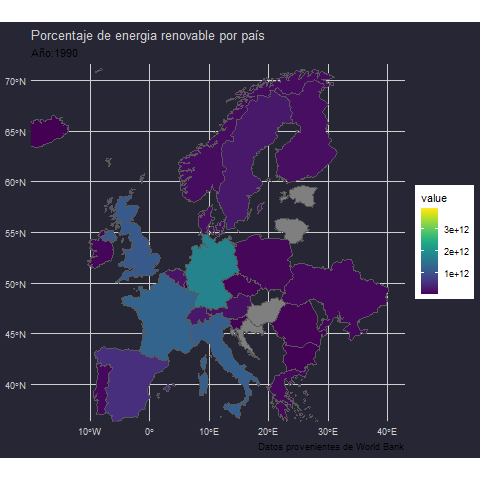

```{r packages-setup, include = FALSE}
library(tidyverse)
library(klippy)  #- remotes::install_github("rlesur/klippy")
library(knitr)
```

```{r chunk-setup, include = FALSE}
knitr::opts_chunk$set(echo = TRUE, eval = TRUE, message = FALSE, warning = FALSE, 
                      #results = "hold",
                      cache = FALSE, cache.path = "/caches/", comment = "#>",
                      #fig.width = 7, #fig.height= 7,   
                      #out.width = 7, out.height = 7,
                      collapse = TRUE,  fig.show = "hold",
                      fig.asp = 7/9, out.width = "60%", fig.align = "center")
knitr::opts_chunk$set(dev = "png", dev.args = list(type = "cairo-png"))
```

```{r options-setup, include = FALSE}
options(scipen = 999) #- para quitar la notación científica
options("yaml.eval.expr" = TRUE) 
```


```{r klippy, echo = FALSE}
klippy::klippy(position = c("top", "right")) #- remotes::install_github("rlesur/klippy")
```

<hr class="linea-black">

Trabajo elaborado para la asignatura "Programación y manejo de datos en la era del Big Data" de la Universitat de València durante el curso 2020-2021. El repo del trabajo está [aquí](https://github.com/perezp44/trabajo_BigData){target="_blank"}. La página web de la asignatura y los trabajos de mis compañeros pueden verse [aquí](https://perezp44.github.io/intro-ds-20-21-web/07-trabajos.html){target="_blank"}.

<!-- El párrafo de arriba has de dejarlo casi igual, 
        solo HAS de SUSTITUIR las 2 veces que aparece "perezp44" por tu usuario de Github-->

<hr class="linea-red">

# 1. Introducción

La introducción **es una de las partes importantes del trabajo**. En la introducción suele ponerse el objetivo, motivación, un pequeño resumen del trabajo y avance de conclusiones si es que hay.

```{r, eval = TRUE}
2 + 2
```


# 2. Datos

Una parte **importante** del trabajo es explicar **de donde proceden los datos** y cual ha sido el proceso de limpieza

```{r, eval = TRUE}
ggplot(iris, aes(Sepal.Length, Petal.Length)) + geom_point()
```


## 2.1. Procesando los datos

Pues eso que tenéis que contar (un poco) el procesado de datos

```{r, eval = TRUE}
DT::datatable(iris)
```


## 3. Trabajos en los que te has basado{.tabset .tabset-pills}

### Gráfico




### Código
```{r eval=FALSE, results=FALSE, echo=TRUE}

library(ggthemes) # Load
library(tidyverse)
library(rio)
library(plotly)
library(janitor)
library(gganimate)
library(viridis)
library("sf")
library(tidyverse)
world <- rnaturalearth::ne_countries(scale = "medium", returnclass = "sf")
world_points<- st_centroid(world)
world_points <- cbind(world, st_coordinates(st_centroid(world$geometry)))

df_pwr<- read_csv("./datos/pib5.csv") %>% select(-c(`Series Name`,`Series Code`))  %>% rename(sovereignt = `Country Name`,
          `1990`=`1990 [YR1990]`,
          `1991`=`1991 [YR1991]`,
          `1992`=`1992 [YR1992]`,
          `1993`=`1993 [YR1993]`,
          `1994`=`1994 [YR1994]`,
          `1995`=`1995 [YR1995]`,
          `1996`=`1996 [YR1996]`,
          `1997`=`1997 [YR1997]`,
          `1998`=`1998 [YR1998]`,
          `1999`=`1999 [YR1999]`,
          `2000`=`2000 [YR2000]`,
          `2001`=`2001 [YR2001]`,
          `2002`=`2002 [YR2002]`,
          `2003`=`2003 [YR2003]`,
          `2004`=`2004 [YR2004]`,
          `2005`=`2005 [YR2005]`,
          `2006`=`2006 [YR2006]`,
          `2007`=`2007 [YR2007]`,
          `2008`=`2008 [YR2008]`,
          `2009`=`2009 [YR2009]`,
          `2010`=`2010 [YR2010]`,
          `2011`=`2011 [YR2011]`,
          `2012`=`2012 [YR2012]`,
          `2013`=`2013 [YR2013]`,
          `2014`=`2014 [YR2014]` ,
          `2015`=`2015 [YR2015]`,
          `2016`=`2016 [YR2016]`,
          `2017`=`2017 [YR2017]`,
          `2018`=`2018 [YR2018]`,
          `2019`=`2019 [YR2019]`

  )

df_pwr20 <- df_pwr %>%  pivot_longer(cols = 3:32, names_to = "year") %>% transform(year = as.numeric(year),
                                                                                  value = as.numeric(value)
                                                                                  )


df_pwr5 <- inner_join(world, df_pwr20, by= c("sovereignt" = "sovereignt")) %>% filter(continent == "Europe", sovereignt != "Bosnia and Herzegovina")

df_pwr9 <- df_pwr5 %>% select(sovereignt, year, value)
p <- ggplot() + geom_sf(data = df_pwr9, aes(fill = value)) +
  labs(title = "Mapa del mundo energias renovables 1990 - 2015",
       caption = "Datos provenientes de World Bank") +
  scale_fill_viridis(direction = 1) +
  transition_time(year) + labs(title = "Porcentaje de energia renovable por país", subtitle = "Año:{as.integer(frame_time)}"  ) +
  coord_sf(xlim = c(-17, 40), ylim = c(38, 70))

anim1 <- animate(p)

anim_save("./imagenes/map.gif", anim1)


```

Es importante que, si habéis utilizado, os habéis basado/ayudado, de algún análisis previo de otro autor, lo digáis claramente.

Por ejemplo, está cita es de NV

> "Nadie llega tan lejos si no es para seguir"


# 4. RECUERDA!!!


<div class = "caja-medium-aquamarine">
Recuerda que **tienes que mandarme un mail** con tu nombre, ususario de Github y nombre de tu trabajo 
</div>

<br>

<div class = "caja-crimson">
Recuerda que el repo de Github **se ha de llamar EXACTAMENTE** "trabajo_BigData"  
</div>

<br>

<div class = "caja-darkkhaki">
Por favor, **no cambies el primer párrafo**. Sirve para dar contexto al trabajo y remitir a los potenciales lectores a la web del curso y poder ver los otros trabajos. Bueno, si que has de cambiar algo: **has de sutituir "perezp44" por tu usuario de Github**, tanto en el archivo index.Rmd como en el Readme.Rmd
</div>


<br>

<div class = "caja-linea-verde">
R️ecureda , el 17 de enero fecha límite para la entrega.
</div>


<br>

<hr class="linea-red">


<div class = "caja-gris-gainboro">
SUERTE!!!!  🧙‍♀️🧙‍♀️
</div>


# 4. Bibliografía

No tienen porque ser artículos o libros; pueden ser posts, repos de Github, paquetes etc ...